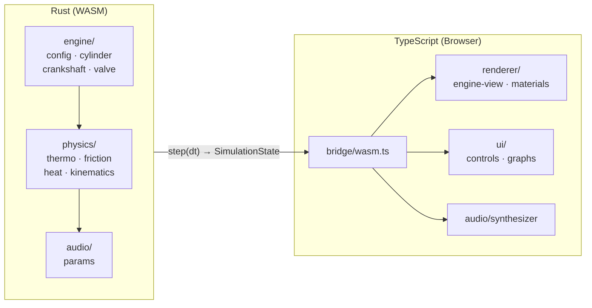

# Strepitus

Physically-accurate engine simulation running in the browser. The core physics engine is written from scratch in Rust (compiled to WebAssembly), with rendering via Three.js.

**strepitus** (Latin) — *noise, rattling, clattering* — the sound an engine makes.

## What This Is

An open-source, browser-based internal combustion engine simulator with:

- **Full thermodynamic simulation** — ideal gas law, Otto cycle, Wiebe combustion model, heat transfer (Woschni correlation)
- **Mechanical physics** — crank-slider kinematics, reciprocating inertia, Coulomb + viscous friction
- **Real-time 2D visualization** — cross-section view with heat coloring, force overlays, P-V diagrams
- **Procedural audio** — combustion pressure mapped to Web Audio API synthesis
- **Configuration-driven** — every parameter (bore, stroke, compression ratio, materials, friction coefficients, valve profiles, fuel chemistry) is tweakable from the UI

Starting point: single-cylinder 4-stroke Otto cycle engine. The architecture supports any configuration — I4, V6, V8, boxer, rotary, 2-stroke, turbine, hybrid.

## Architecture



**Key principle:** The Rust engine outputs a `SimulationState` struct each tick containing positions, temperatures, pressures, and forces. The renderer reads this state. No rendering logic in Rust, no physics in JS.

## Prerequisites

### Rust & wasm-pack

```bash
# Install Rust
curl --proto '=https' --tlsv1.2 -sSf https://sh.rustup.rs | sh

# On Windows, download and run:
# https://win.rustup.rs/x86_64

# Add the WASM target
rustup target add wasm32-unknown-unknown

# Install wasm-pack
cargo install wasm-pack
```

### Bun

```bash
# macOS / Linux
curl -fsSL https://bun.sh/install | bash

# Windows
powershell -c "irm bun.sh/install.ps1 | iex"
```

## Getting Started

```bash
# 1. Build the WASM module
cd crates/strepitus-core
wasm-pack build --target web --out-dir ../../web/src/wasm

# 2. Install web dependencies
cd ../../web
bun install

# 3. Start the dev server
bun run dev
```

The app opens at `http://localhost:3000`. You should see a 2D engine cross-section with a moving piston and real-time telemetry.

### Controls

| Key | Action |
|-----|--------|
| Space | Pause / resume |
| Arrow Up | Increase RPM (+100) |
| Arrow Down | Decrease RPM (-100) |

## Development

### Rebuild WASM after Rust changes

```bash
# From web/ directory
bun run wasm:build    # Release build
bun run wasm:dev      # Debug build (faster compile, larger output)
```

### Project Structure

| Path | Description |
|------|-------------|
| `crates/strepitus-core/` | Rust physics engine (compiles to WASM) |
| `crates/strepitus-core/src/engine/` | Engine components: cylinder, crankshaft, valves, config |
| `crates/strepitus-core/src/physics/` | Thermodynamics, friction, heat transfer, kinematics |
| `crates/strepitus-core/src/audio/` | Physics → audio parameter mapping |
| `crates/strepitus-core/src/types.rs` | `SimulationState` — the physics↔rendering contract |
| `web/` | Vite + TypeScript frontend |
| `web/src/bridge/` | WASM loading and Rust↔JS interface |
| `web/src/renderer/` | Three.js 2D cross-section rendering |
| `web/src/ui/` | Controls and real-time graphs |
| `web/src/audio/` | Web Audio API procedural synthesis |
| `web/src/presets/` | JSON engine configurations |

## Physics Model

### Kinematics
Exact crank-slider mechanism — no small-angle approximations. Piston position, velocity, and acceleration derived from crank angle and connecting rod geometry.

### Thermodynamics
- Ideal gas law (PV = nRT)
- Otto cycle: intake → compression → combustion → expansion → exhaust
- Wiebe function for heat release during combustion
- Woschni-style convective heat transfer correlation
- Conduction through cylinder walls, convection to coolant

### Friction
- Piston ring friction: Coulomb (pressure-dependent) + viscous (velocity-dependent)
- Bearing friction: constant drag + speed-dependent viscous component

### Valve Train
- Sinusoidal cam profile approximation
- Configurable timing: IVO, IVC, EVO, EVC in crank degrees
- Variable lift profiles

## Roadmap

- [x] Phase 1 — Project scaffolding & WASM pipeline
- [ ] Phase 2 — Core kinematics (crank angle → piston motion → rendered)
- [ ] Phase 3 — Thermodynamics (Otto cycle, gas laws, Wiebe combustion)
- [ ] Phase 4 — Friction & heat transfer
- [ ] Phase 5 — 2D visualization (heat coloring, P-V diagrams, force vectors)
- [ ] Phase 6 — Procedural audio (combustion, exhaust, mechanical noise)
- [ ] Phase 7 — Advanced UI (full parameter panel, presets, save/load)
- [ ] Phase 8 — Multi-cylinder support (I4, V6, V8, firing orders)
- [ ] Future — Rotary, 2-stroke, turbine, hybrid, custom WebGPU renderer

## License

MIT — see [LICENSE](LICENSE).
