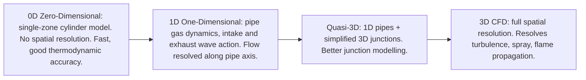
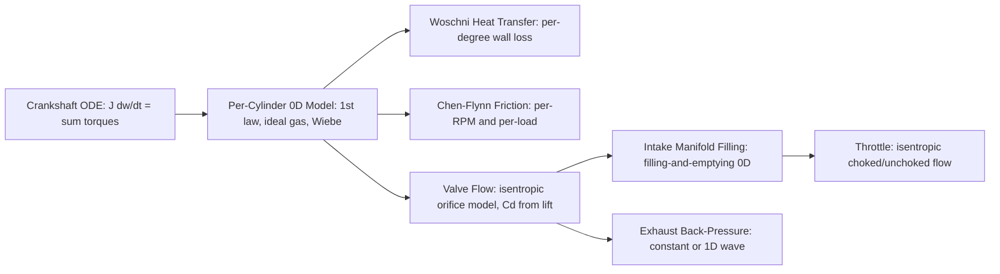

# Engine Simulation — Overview

## Purpose

This folder documents how each engine subsystem is simulated, from simple empirical
correlations to full 3D CFD. For each component, we cover:

1. The hierarchy of available models (0D → 1D → 3D)
2. The specific equations and their calibration constants
3. What commercial tools (GT-Power, AVL BOOST, Ricardo WAVE, ANSYS Forte) do
4. What accuracy is achievable at each level vs. real-world measurements
5. What we need to implement for near 1:1 accuracy

**Target accuracy:** outputs within ±2–5% of measured values for torque, IMEP, BSFC,
peak pressure, and EGT across the operating map. This is achievable with a well-calibrated
0D thermodynamic model + 1D gas exchange.

---

## Simulation Fidelity Levels

| Level | Compute time per cycle | Torque accuracy | Combustion accuracy | Use case |
|---|---|---|---|---|
| 0D | Milliseconds | ±3–8% (uncalibrated), ±1–3% (calibrated) | Moderate (Wiebe model) | Parametric studies, real-time |
| 1D | Seconds | ±2–5% | Good (with measured HR input) | Engine development, calibration |
| Quasi-3D | Minutes | ±1–3% | Good | Intake/exhaust optimisation |
| 3D CFD | Hours–days | ±1–2% | Excellent (LES combustion) | Combustion chamber design |

Our target is the **1D level** for the whole engine, with **0D cylinders** — the
same architecture used by GT-Power, AVL BOOST, and Ricardo WAVE.

---

## Commercial Engine Simulation Tools

### GT-Power (Gamma Technologies)

The industry standard for 1D engine simulation. Used by virtually every major OEM.

- **Model type:** 1D gas dynamics for all pipes; 0D single-zone or two-zone cylinders
- **Combustion models:** Wiebe (predictive), SI Turbulent Flame, DI Diesel, etc.
- **Heat transfer:** Woschni, Hohenberg, or user-defined
- **Friction:** Chen-Flynn or user-defined map
- **Accuracy:** ±2–3% on torque and power vs dyno, ±5°C on EGT, ±1–2 bar on IMEP

### AVL BOOST (AVL List GmbH)

Competitor to GT-Power, widely used in Europe.

- Similar 1D architecture, strong diesel combustion models
- Tightly integrated with AVL measurement tools (Indicom for combustion analysis)

### Ricardo WAVE

- 1D gas dynamics, strong acoustic modelling
- Popular for exhaust/intake noise prediction

### OpenWAM (CMT-Motores Térmicos, UPV)

- Open-source 1D code, research-grade
- Good for learning the Method of Characteristics

### ANSYS Forte / Converge CFD

- 3D reacting flow CFD for combustion chamber design
- Level of detail: individual fuel spray droplets, turbulent flame front

---

## Our Simulation Architecture

To reach near 1:1 accuracy we implement:

---

## Key Calibration Parameters

A simulation is only as good as its inputs. The parameters that most strongly affect
output accuracy:

| Parameter | Effect on output | Source |
|---|---|---|
| Combustion duration (Δθ) | IMEP ±5–10%, peak pressure | Combustion analysis |
| Spark timing | Peak pressure location, IMEP | ECU logging |
| Wiebe shape (a, m) | Burn rate shape | Fit to measured dQ/dθ |
| Woschni C1 constant | Heat loss ±15% | Calibration to measured IMEP vs indicated |
| FMEP constants | BSFC ±5% | Motored friction test |
| Volumetric efficiency map | Torque vs RPM | Flow bench + dyno |
| Discharge coefficients Cd | Gas exchange accuracy | Flow bench |

---

## Component Files

- [01-combustion-chamber.md](01-combustion-chamber.md) — volume geometry, area
- [02-piston-assembly.md](02-piston-assembly.md) — reciprocating mass, ring friction
- [03-connecting-rod.md](03-connecting-rod.md) — slider-crank kinematics, torque
- [04-crankshaft-flywheel.md](04-crankshaft-flywheel.md) — rotational ODE, integration
- [05-valve-train.md](05-valve-train.md) — lift profiles, valve flow (orifice model)
- [06-intake-system.md](06-intake-system.md) — filling-and-emptying, throttle flow
- [07-fuel-system.md](07-fuel-system.md) — fuel mass, heat release, AFR model
- [08-ignition-system.md](08-ignition-system.md) — Wiebe, autoignition (Arrhenius)
- [09-thermodynamics.md](09-thermodynamics.md) — 0D 1st law ODE, real gas properties
- [10-friction-losses.md](10-friction-losses.md) — Chen-Flynn, Stribeck ring model
- [11-heat-transfer.md](11-heat-transfer.md) — Woschni, Hohenberg, Annand
- [12-exhaust-system.md](12-exhaust-system.md) — back-pressure, blowdown, 1D MoC
- [13-lubrication.md](13-lubrication.md) — viscosity model, Petroff bearing friction
- [14-cooling-system.md](14-cooling-system.md) — lumped thermal network, coolant ODE
- [15-forced-induction.md](15-forced-induction.md) — map interpolation, turbo ODE
- [16-engine-management.md](16-engine-management.md) — ECU control loops
- [17-multi-cylinder.md](17-multi-cylinder.md) — phase-shifted integration, balance
