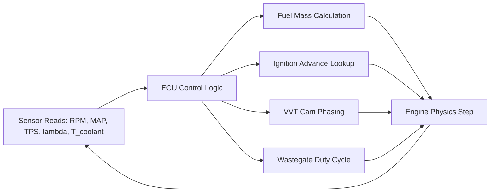

# Simulation — Engine Management

## What Is Simulated

The engine management model implements the control logic that governs fuel delivery,
ignition timing, VVT cam phasing, boost control, and closed-loop lambda correction.
In simulation it acts as the controller layer on top of the physics model.

---

## Architecture: Control Layer



The control layer runs at each simulation step (per crank-degree or per cycle),
reading simulated sensor values and computing actuator commands.

---

## Fuel Mass Calculation

### Aircharge-Based Fuelling

```
  ṁ_air = ρ_air × V_displaced × ηv / (2 × N_cycles_per_rev)

  m_fuel = ṁ_air / (AFR_stoich × λ_target)

  Injector pulse width:
  PW = m_fuel / (K_inj × P_fuel_rail^0.5) + t_dead

  where:
    K_inj    = injector flow coefficient [kg/(s·Pa^0.5)]
    t_dead   = injector dead time [s] (typically 0.5–0.7 ms at 14 V)
    P_fuel_rail = fuel rail pressure [Pa]
```

### Lambda Target vs Operating Condition

```
  λ_target(RPM, load):
    Idle:             λ = 1.00 (stoichiometric)
    Cruise:           λ = 1.00–1.05 (slight lean for BSFC)
    WOT:              λ = 0.87–0.95 (rich for power + cooling)
    Overrun (fuel cut): λ = ∞ (injectors off)
    Cold start:       λ = 0.85–0.95 (enrichment)
```

---

## Ignition Timing Model

### Map Lookup

```
  θ_spark = f(RPM, load)    [degrees BTDC]

  Interpolated bilinearly from:
    RPM axis: [idle, 1000, 2000, 3000, 4000, 5000, 6000, 7000, 8000]
    Load axis: [0.2, 0.4, 0.6, 0.8, 1.0] [bar MAP or normalized load]

  Representative values (naturally aspirated, 91 RON):
    RPM\Load  0.2   0.4   0.6   0.8   1.0
    1000      15    12    10     8     6
    2000      25    22    18    14    10
    3000      32    28    24    18    12
    4000      35    32    28    22    16
    6000      38    35    32    28    20
```

### Knock Retard

```
  If knock detected (Livengood-Wu integral → 1):
    θ_spark -= Δθ_retard    [°, typically 2–4° per event]

  Recovery:
    θ_spark += Δθ_advance_per_cycle    [°/cycle, typically 0.5–1° per cycle]

  Limit: θ_spark ≥ θ_MBT - 10°  (don't retard more than 10° below MBT)
```

---

## VVT Cam Phasing

### Cam Advance vs RPM/Load Map

```
  φ_int(RPM, load) [°CA advance]:
    At low RPM / low load: 0–10° advance (reduce overlap, idle stability)
    At mid RPM / high load: 15–30° advance (maximise ηv, improve IMEP)
    At high RPM: reduce back toward 0–10° (avoid exhaust backflow at high speeds)

  φ_exh(RPM, load) [°CA retard]:
    At low-mid RPM: 5–15° retard (increase effective expansion, reduce pumping)
    At high RPM: return toward 0° (avoid exhaust restriction)
```

### Effect on Volumetric Efficiency

```
  ηv(RPM, φ_int, φ_exh) = ηv_base(RPM) × K_vvt(φ_int, φ_exh)

  K_vvt: tabulated correction factor, range 0.95–1.08
  At optimal cam phasing: ηv increases 5–8% vs fixed timing
```

---

## Closed-Loop Lambda Control

### Two-State (Narrowband) Controller

```
  error = λ_measured - λ_target

  STFT (short-term fuel trim):
    if error > 0 (lean): STFT -= Δ_step  (reduce fuel)
    if error < 0 (rich): STFT += Δ_step  (add fuel)

    Δ_step = 0.005 per control cycle  (typical)
    STFT range: ±25%

  LTFT adapts to remove systematic STFT bias:
    LTFT += K_LTFT × STFT    [accumulated slowly]

  Final fuel correction:
    m_fuel_actual = m_fuel_base × (1 + STFT/100 + LTFT/100)
```

### Wideband PID Controller

```
  error = λ_target - λ_measured

  STFT = K_p × error + K_i × ∫error dt

  Typical gains (after auto-tuning):
    K_p = 0.05 (fuel trim % / lambda error)
    K_i = 0.02 (fuel trim % / (lambda error × second))

  Transport delay compensation:
    Predict lambda from injected fuel mass 2–4 engine cycles earlier
    Smith predictor or dead-time compensator
```

---

## Boost Control (Wastegate PID)

```
  error = P_boost_target(RPM) - P_boost_actual

  WG_duty = K_p × error + K_i × ∫error dt + K_d × Δerror/Δt

  Typical PID gains:
    K_p = 0.8   [% duty / bar error]
    K_i = 0.4   [% duty / (bar × s)]
    K_d = 0.05  [% duty / (bar/s)]

  Anti-windup: clamp ∫error to ±50

  WG_duty → A_WG (wastegate area) → ṁ_bypass (turbine bypass flow)
```

### Feed-Forward Boost Map

```
  WG_duty_FF = g(RPM, T_ambient)    [open-loop base from calibration]
  WG_duty_total = WG_duty_FF + WG_duty_PID

  Feed-forward reduces PID integral wind-up during transients
```

---

## Idle Speed Control

```
  ISC valve: throttle bypass orifice with duty-cycle controlled solenoid
  Target RPM at warm idle: N_idle_target = 650–800 RPM

  PI controller:
    error = N_idle_target - N_actual
    ISC_duty = K_p_idle × error + K_i_idle × ∫error dt

  Load compensation:
    ISC_duty += K_ac × AC_load + K_alt × alternator_load

  Typical K_p_idle = 0.02 [% duty / RPM error]
```

---

## Cold Start Enrichment

```
  Enrichment multiplier:
    K_cold(T_coolant) = 1 + A_enrich × exp(-B_enrich × T_coolant)

    At T_coolant = 20°C: K_cold ≈ 1.20 (20% extra fuel)
    At T_coolant = 40°C: K_cold ≈ 1.10
    At T_coolant = 80°C: K_cold ≈ 1.00 (no enrichment)

  Decay: enrichment reduces linearly with time after start
    decay_rate ≈ 0.01 per second
```

---

## Misfire Detection

```
  Crankshaft acceleration method:
    δ_i = (ω_i - ω_i-1) / ω_mean    [fractional speed variation per cylinder event]

    Normal: |δ_i| < 0.02
    Misfire: |δ_i| > threshold (calibrated, typically 0.05–0.15)

  Integration in simulation:
    Compute ω at each firing TDC from torque integration
    Flag misfire if IMEP < 0 or negative torque contribution
```

---

## Accuracy vs Measured ECU Response

| Control function | Model approach | Accuracy vs real ECU |
|---|---|---|
| Fuel mass (open loop) | Air-charge × AFR | ±1–2% (depends on ηv accuracy) |
| Lambda closed-loop SS | PI trim | ±0.005 lambda at steady state |
| Ignition advance (open loop) | Map interpolation | ±0.5° CA (map resolution) |
| Boost control SS error | PID + feed-forward | ±0.05 bar |
| Cold start enrichment | Exponential decay | ±5% fuel (calibrated) |
| Idle RPM SS | PI control | ±20 RPM |
| Cam phasing effect on ηv | K_vvt table | ±3–5% ηv |
