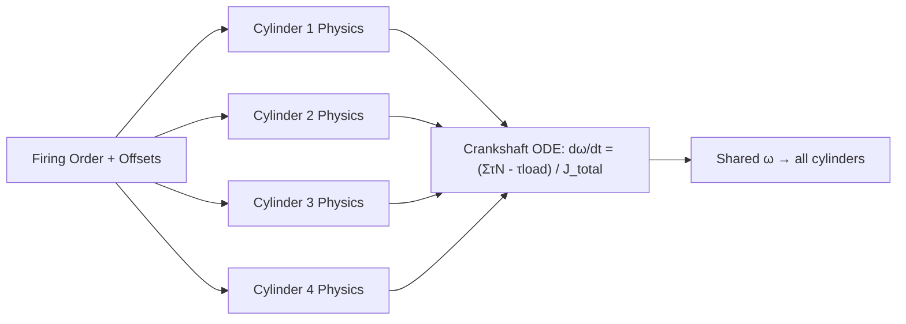

# Simulation — Multi-Cylinder Engines

## What Is Simulated

The multi-cylinder model runs N independent single-cylinder physics instances
(thermodynamics, kinematics, valve flow, heat transfer, friction) in phase-shifted
sequence, then combines their torque contributions on a shared crankshaft ODE.
Balance forces, torsional dynamics, and acoustic signatures emerge from the combined
simulation.

---

## Phase-Shifted Integration Architecture



### Crank Offset Definition

```
  θ_i(t) = θ_0(t) + φ_i

  where:
    θ_0 = reference crankshaft angle (cylinder 1 at TDC = 0°)
    φ_i = firing offset for cylinder i [°CA]

  4-cylinder I4 (720°/4 = 180° per cylinder, 4-stroke):
    Firing order 1-3-4-2:
    φ_1 = 0°,  φ_3 = 180°,  φ_4 = 360°,  φ_2 = 540°

  6-cylinder I6 (720°/6 = 120° per cylinder):
    Firing order 1-5-3-6-2-4:
    φ_1=0°, φ_5=120°, φ_3=240°, φ_6=360°, φ_2=480°, φ_4=600°

  8-cylinder V8 (720°/8 = 90° per cylinder):
    Bank A: 0°, 180°, 270°, 90°   Bank B: 90°, 270°, 180°, 0°
    (exact offsets depend on crankshaft pin layout and bank angle)
```

---

## Crankshaft ODE

### Equation of Motion

```
  J_total × dω/dt = Σ τ_gas_i(θ_i) + Σ τ_inertia_i(θ_i) - τ_friction - τ_load

  where:
    τ_gas_i    = gas force torque contribution from cylinder i
    τ_inertia_i = reciprocating inertia torque from cylinder i
    τ_friction  = total engine friction torque (FMEP × V_d / (2π))
    τ_load      = external load torque (dyno, drivetrain)

  J_total = J_crankshaft + J_flywheel + Σ J_equivalent_recip_i
```

### Per-Cylinder Torque Contribution

```
  For each cylinder i at angle θ_i:
    τ_gas_i = F_gas_i × r × sin(θ_i + β_i) / cos(β_i)

    F_gas_i  = (P_cyl_i - P_crank) × A_piston
    β_i      = arcsin((r/l) × sin(θ_i))    [connecting rod angle]

  Net crankshaft torque:
    τ_net = Σ_i τ_gas_i - τ_friction - τ_load
```

### Integration

```
  Use RK4 (4th-order Runge-Kutta) on the crankshaft ODE:
    dθ/dt = ω
    dω/dt = τ_net / J_total

  Time step: Δθ = 0.5–1.0° CA → Δt = Δθ / ω

  At each time step:
    1. Update θ_i = θ_0 + φ_i for all cylinders
    2. Call single-cylinder physics step for each cylinder
    3. Sum torque contributions
    4. Integrate ω and θ_0
```

---

## Balance Force Computation

### Primary and Secondary Forces

```
  Reciprocating mass of cylinder i at position z_i along crank axis:

  F_recip_i(θ_i) = m_recip × r × ω² × (cos(θ_i) + (r/l) × cos(2θ_i))

  Primary force (1st harmonic):
    F_P = Σ_i m_recip × r × ω² × cos(θ_i)

  Secondary force (2nd harmonic):
    F_S = Σ_i m_recip × r × ω² × (r/l) × cos(2θ_i)

  Primary couple (rocking moment):
    M_P = Σ_i m_recip × r × ω² × cos(θ_i) × z_i
```

### Balance State by Configuration

```
  I4 (firing order 1-3-4-2, 180° spacing):
    F_P = 0  (primary balanced)
    F_S ≠ 0  (all cosines add — secondary force NOT balanced)
    M_P = 0  (symmetric)
    → Balance shafts at 2× engine speed needed to cancel F_S

  I6 (120° spacing):
    F_P = 0, F_S = 0, M_P = 0
    → Inherently balanced (all orders cancel)

  V8 (flat-plane, 90° firing):
    F_P = 0, F_S = 0  (cross-plane crankshaft achieves balance)
    → Inherently balanced primary and secondary forces
    → Residual 4th-order rocking couple (small)
```

---

## Torsional Crankshaft Model

### Multi-Inertia Torsional Chain

```
  Model: discrete rotational inertias connected by shaft stiffness

  [J₁ --|k₁₂|-- J₂ --|k₂₃|-- J₃ --|k₃₄|-- J₄ --|k₄₅|-- J₅_flywheel]

  J₁–J₄: crankshaft sections between throws
  k_ij: torsional stiffness of shaft section [N·m/rad]
  Typical k: 10⁵–10⁶ N·m/rad per crank throw spacing

  ODE system (N degrees of freedom):
    J_i × d²θ_i/dt² = τ_gas_i - k_i,i+1 × (θ_i - θ_{i+1}) + k_{i-1,i} × (θ_{i-1} - θ_i) - c × dθ_i/dt

  Matrix form:
    [J] × {θ̈} + [C] × {θ̇} + [K] × {θ} = {τ}
```

### Natural Frequencies

```
  Eigenvalue problem: ([K] - ω_n² × [J]) × {φ} = 0

  Solved to find torsional natural frequencies ω_n_i

  Resonance check: does any ω_n_i coincide with:
    N_excitation × engine_order × 2π / 60 = ω_n_i ?

  If yes: torsional resonance at that RPM → verify damping is sufficient
  Damping ratio target: ζ > 0.05 to avoid large amplification
```

---

## Cylinder-to-Cylinder Balance Simulation

### IMEP Variation from Physical Differences

```
  Sources of cylinder-to-cylinder IMEP variation to model:

  1. Injector flow variation:
     m_fuel_i = m_fuel_nominal × (1 + δ_inj_i)
     δ_inj_i: Gaussian, σ ≈ 0.5–1%

  2. Compression ratio variation (machining tolerance):
     CR_i = CR_nominal + δ_CR_i
     δ_CR_i: Gaussian, σ ≈ 0.1 (e.g. 10.0 ± 0.1)

  3. Intake air distribution non-uniformity:
     m_air_i = m_air_nominal × (1 + δ_dist_i)
     From CFD or empirical correction for runner length

  4. VVT phasing deviation:
     φ_vvt_i = φ_cmd + δ_phaser_i
     δ_phaser_i: ±1–2° resolution of hydraulic phaser
```

### IMEP Standard Deviation Check

```
  σ_IMEP / μ_IMEP × 100 < 2%  → acceptable balance
  > 5%  → significant imbalance, investigate source
```

---

## Acoustic Signature from Multi-Cylinder

### Combustion Noise Order Content

```
  Each cylinder fires once every 720° (4-stroke) → fundamental at 0.5 × engine order

  I4 (4 cylinders, 4-stroke):
    Fundamental firing frequency: 2 × RPM/60 Hz  (2nd engine order)
    Dominant orders: 2, 4, 6, 8 (even harmonics)

  I6:
    Fundamental: 3 × RPM/60 Hz  (3rd engine order)
    Dominant orders: 3, 6, 9 ...

  V8:
    Dominant orders: 4, 8, 12 ...

  Combustion noise amplitude per order:
    A_order(k) = |FFT(τ_net(θ))|_at_k    [N·m amplitude]
```

### Acoustic Roughness Metric

```
  Pressure-rise rate per cylinder:
    (dP/dθ)_max → contributes to block excitation at combustion frequency

  Multi-cylinder phase diversity smears peaks:
    With N cylinders: peak torque ripple amplitude ÷ N (approximately)
    → I6 and V12 are inherently smoother than I4
```

---

## Accuracy vs Measured Data

| Quantity | Model | Accuracy vs measured |
|---|---|---|
| Net crankshaft torque (steady) | Sum of cylinder contributions | ±2–3% (depends on single-cyl accuracy) |
| IMEP cylinder-to-cylinder spread | Physical variation model | ±0.5% IMEP (with injector scatter) |
| Primary balance forces | Analytical reciprocating mass sum | < 1% (geometry known exactly) |
| Secondary balance forces | Same | < 1% |
| Torsional resonance frequency | Multi-J eigenvalue model | ±5–10% (stiffness uncertainty) |
| Torsional vibration amplitude | Multi-J ODE | ±15–25% (damping uncertainty) |
| Firing order torque ripple | FFT of torque trace | ±5% amplitude per order |
| Combustion noise NI | dP/dθ proxy | ±1–2 dB |
