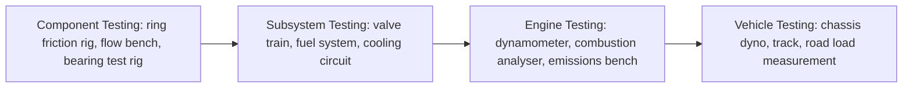
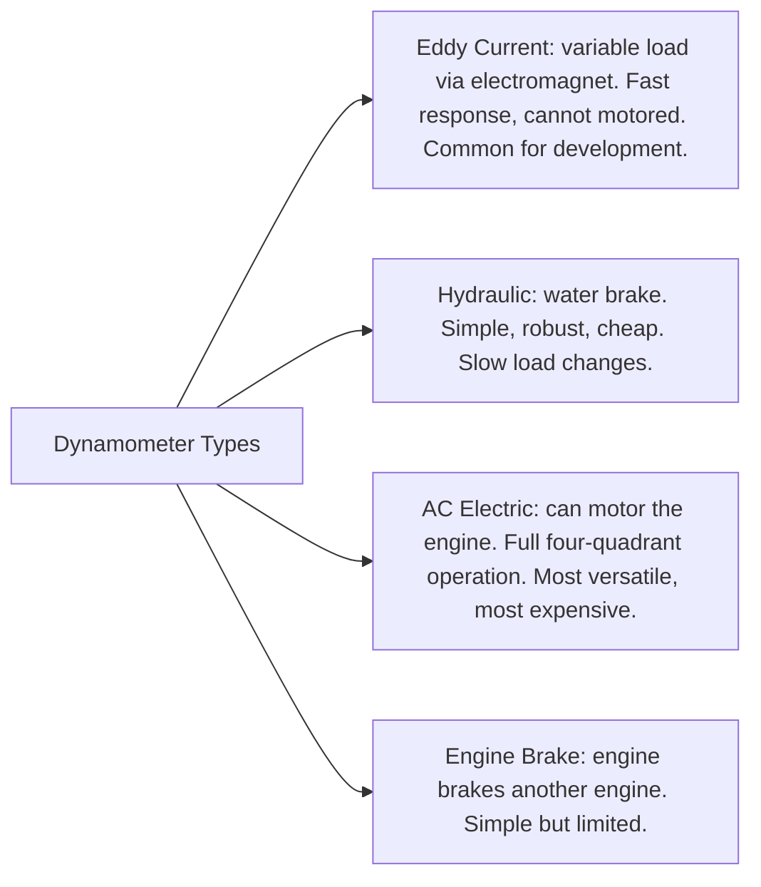
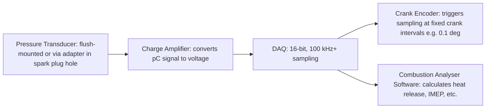

# Engine Testing — Overview

## Purpose

Real-world engine testing is the ground truth against which all simulations are
validated. Without measured data, a simulation has no anchor — it can only be
self-consistent, not accurate. This folder documents how each engine subsystem is
tested, what instruments are used, what accuracy is achievable, and what the test
data looks like.

The goal of referencing this material is: **every parameter in our simulation should
be traceable to a real measurement, and every output should be comparable to a
measurement that can be taken on a real engine.**

---

## Testing Hierarchy

Each level adds complexity and cost but better represents real operating conditions.
Simulation must be validated at multiple levels — a combustion model validated only
on a single-cylinder test engine may not be accurate on a V8 with different porting.

---

## The Engine Dynamometer

The engine dynamometer (dyno) is the central tool for engine testing. It connects
to the crankshaft and applies a controlled load while measuring torque and speed.

### Dyno Types

**AC electric dynos** are the industry standard for development because they can:
- Motor the engine (measure friction with no combustion)
- Run transient test cycles (simulating real driving)
- Recover energy back to the grid during braking

### Measured Quantities

| Quantity | Instrument | Typical accuracy |
|---|---|---|
| Torque | Load cell on dyno arm | ±0.1–0.5% FS |
| Speed (RPM) | Encoder on dyno shaft | ±1 RPM |
| Brake Power | Computed: P = τ × ω | ±0.5–1% |
| Fuel flow | Coriolis mass flow meter | ±0.1–0.2% |
| Air flow | Laminar flow element or hot-film MAF | ±0.5–1% |
| Coolant temperature | PT100 RTD | ±0.1°C |
| Oil temperature | Thermocouple (K-type) | ±1–2°C |
| Exhaust temperature | K-type thermocouple | ±2–5°C |
| Manifold pressure | Piezoresistive pressure transducer | ±0.1% FS |

---

## Combustion Analysis

The most important measurement for thermodynamic simulation validation is
**in-cylinder pressure** as a function of crank angle.

### Equipment Chain

**Key suppliers:** Kistler (6115C, 6125C transducers), AVL (GH14D, Indicom software),
PCB Piezotronics

### What Combustion Analysis Provides

- P(θ) — cylinder pressure trace at 0.1° or 0.5° resolution
- V(θ) — computed from encoder + known engine geometry
- P-V diagram — calculated from P(θ) and V(θ)
- IMEP — net indicated mean effective pressure (integral of P·dV)
- Heat release rate dQ/dθ — from 1st law applied to measured P and V
- Peak pressure and its location (θ_Pmax)
- CA50 — crank angle at 50% mass fraction burned
- Burn duration (CA10–CA90, CA0–CA100)
- COVIMEP — cycle-to-cycle variability (coefficient of variation of IMEP)

---

## Emissions Measurement

A five-gas exhaust emissions analyser measures:

| Emission | Analyser type | Method |
|---|---|---|
| HC (hydrocarbons) | FID (Flame Ionisation Detector) | Ionisation of C-H bonds |
| CO | NDIR (Non-Dispersive Infrared) | IR absorption at 4.67 µm |
| CO₂ | NDIR | IR absorption at 4.26 µm |
| NOx (NO + NO₂) | CLD (Chemiluminescence Detector) | NO + O₃ → NO₂ + hν |
| O₂ | Electrochemical cell or paramagnetic | — |
| Lambda | Calculated or wideband sensor | From exhaust composition |

---

## Data Acquisition System (DAQ)

All sensor signals are sampled synchronously at high rate. Two sampling modes:

- **Time-based:** samples at fixed intervals (e.g. 10 kHz). Simple but couples time
  resolution to RPM.
- **Angle-based (preferred):** samples at fixed crank angle intervals (e.g. every 0.1°)
  triggered by the encoder. Each sample represents the same engine position regardless
  of RPM — required for combustion analysis.

---

## Test Standards

| Standard | Scope |
|---|---|
| SAE J1349 | Engine power and torque test procedure |
| ISO 1585 | Road vehicle engine test code |
| SAE J1979 | OBD-II diagnostic services |
| ECE R85 | Net power measurement (Europe) |
| SAE J2723 | Dynamometer calibration |

---

## Component Files

- [01-combustion-chamber.md](01-combustion-chamber.md) — cylinder pressure, P-V analysis
- [02-piston-assembly.md](02-piston-assembly.md) — ring friction, piston temperature
- [03-connecting-rod.md](03-connecting-rod.md) — strain gauges, inertia measurement
- [04-crankshaft-flywheel.md](04-crankshaft-flywheel.md) — torsional vibration, inertia
- [05-valve-train.md](05-valve-train.md) — cam profile, valve lift, flow bench
- [06-intake-system.md](06-intake-system.md) — flow bench, volumetric efficiency
- [07-fuel-system.md](07-fuel-system.md) — injector characterisation, AFR measurement
- [08-ignition-system.md](08-ignition-system.md) — spark timing, knock detection
- [09-thermodynamics.md](09-thermodynamics.md) — heat release analysis, cycle statistics
- [10-friction-losses.md](10-friction-losses.md) — motored friction, FMEP, teardown
- [11-heat-transfer.md](11-heat-transfer.md) — thermocouples, heat flux sensors
- [12-exhaust-system.md](12-exhaust-system.md) — exhaust pressure, emissions
- [13-lubrication.md](13-lubrication.md) — oil pressure, bearing clearance, oil analysis
- [14-cooling-system.md](14-cooling-system.md) — heat rejection, thermostat test
- [15-forced-induction.md](15-forced-induction.md) — compressor map measurement, boost
- [16-engine-management.md](16-engine-management.md) — ECU logging, calibration tools
- [17-multi-cylinder.md](17-multi-cylinder.md) — cylinder balance, NVH, vibration
