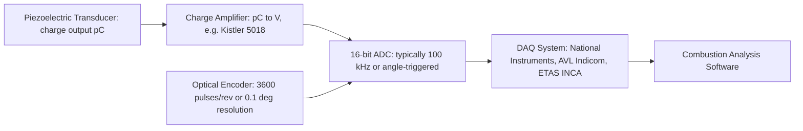

# Testing — Combustion Chamber

## What Is Tested

The combustion chamber geometry (bore, stroke, clearance volume, compression ratio)
and the in-cylinder thermodynamic process (cylinder pressure trace, heat release).
This is the most information-rich measurement in engine testing — a single pressure
trace contains the fingerprint of combustion, heat transfer, and gas exchange.

---

## Cylinder Pressure Measurement

### Transducer

A piezoelectric pressure transducer is installed flush with the combustion chamber
surface — either in a dedicated port, via a spark plug adaptor, or replacing the
glow plug in a diesel.

**Common transducers:**

| Model | Manufacturer | Pressure range | Sensitivity | Thermal shock |
|---|---|---|---|---|
| Kistler 6115C | Kistler | 0–250 bar | ~20 pC/bar | Very low drift |
| Kistler 6125C | Kistler | 0–300 bar | ~16 pC/bar | Standard |
| AVL GH14D | AVL | 0–200 bar | ~16 pC/bar | Low |
| PCB 112B11 | PCB | 0–350 bar | ~1.6 pC/bar | Standard |

**Thermal shock error:** As the flame front sweeps past the transducer, the
diaphragm is briefly heated, causing a spurious pressure reading. Modern transducers
use a silicone coating or a water-cooled mount to minimise this. Error: ~0.1–0.5 bar
on peak pressure if uncorrected.

### Signal Chain



### Pegging (Absolute Pressure Reference)

Piezoelectric transducers measure relative pressure changes, not absolute pressure.
They must be **pegged** (referenced) to a known pressure point each cycle:

- **BDC pegging:** assume cylinder pressure equals manifold pressure at BDC of the
  intake stroke (valid at low RPM, low restriction)
- **TDC motored pegging:** assume compression follows isentropic law — back-calculate
  absolute pressure at TDC from the known compression ratio
- **Thermodynamic pegging:** minimise pressure offset residual across the cycle

Pegging error is the primary source of IMEP uncertainty: ±0.1 bar offset in pegging
causes ±0.1 bar × Vd error in indicated work, roughly ±1–3% IMEP error.

---

## Crank Angle Encoder

The encoder synchronises pressure samples to crankshaft position. Key specifications:

- **Resolution:** 3600 pulses/revolution = 0.1° resolution (standard)
- **Accuracy:** ±0.02° over full revolution (optical, class A)
- **Index pulse:** one pulse per revolution for absolute reference
- **TDC offset calibration:** the encoder must be aligned to true TDC,
  not nominal TDC from the timing marks. Done with a capacitive or optical TDC sensor.

TDC offset error of 1° causes: IMEP error ≈ 1–3%, peak pressure location error ≈ 1°,
CA50 error ≈ 1°. Must be calibrated on every installation.

---

## Derived Combustion Metrics

From P(θ) and V(θ), combustion analysis software computes:

### Heat Release Rate (HRR)

From the first law applied to the closed cylinder:

```
  dQ/dθ = (γ/(γ-1)) × P × dV/dθ + (1/(γ-1)) × V × dP/dθ + dQ_wall/dθ

  Single-zone: γ treated as constant (or T-dependent)
  More accurate: subtract wall heat loss (from Woschni correlation)
```

Cumulative heat release:
```
  Q(θ) = ∫ dQ/dθ dθ    [J]
```

### Burn Fraction and CA50

```
  x_b(θ) = Q(θ) / Q_total

  CA50 = θ at x_b = 0.5    (50% mass fraction burned)
  CA10 = θ at x_b = 0.1
  CA90 = θ at x_b = 0.9
  Burn duration = CA90 - CA10
```

### IMEP

```
  IMEP_net = (1/Vd) × ∮ P dV    [Pa or bar]
  IMEP_gross = closed cycle only (compression + power stroke)
  PMEP = gross - net = pumping mean effective pressure
```

### Cycle-to-Cycle Variability

```
  COVIMEP = σ_IMEP / mean_IMEP × 100%    [%]

  < 3%: good stability (normal operation)
  3–5%: borderline — may perceive as rough idle
  > 5%: misfire risk — check ignition, AFR, EGR rate
```

---

## Clearance Volume Measurement

The exact clearance volume Vc (and therefore compression ratio) is measured by:

1. **Fluid displacement:** remove piston, flood cylinder to a reference mark, measure
   fluid volume (accurate to ±0.1 cm³)
2. **Trace gas method:** fill at TDC with known gas pressure, measure pressure ratio
   at BDC → compute CR directly
3. **From pressure trace:** isentropic compression law: P_TDC/P_BDC = CR^γ →
   solve for CR (requires accurate γ)

Method 1 is the most direct and most accurate for determining CR.

---

## Bore and Stroke Measurement

- **Bore:** measured with a bore gauge or internal micrometer. Accuracy: ±2 µm.
  Multiple points across bore and at multiple depths to detect taper and out-of-round.
- **Stroke:** measured by locating TDC and BDC piston positions with a depth gauge.
  Accuracy: ±0.01 mm.
- **Con rod length:** direct measurement of removed rod. Accuracy: ±0.01 mm.

---

## Key Accuracy Summary

| Measurement | Typical uncertainty |
|---|---|
| Cylinder pressure | ±0.1–0.3 bar (random), ±0.5 bar (pegging) |
| Crank angle position | ±0.02° |
| IMEP (net) | ±1–3% |
| CA50 | ±0.5–1.0° |
| Peak pressure | ±0.5–1.0 bar |
| Compression ratio | ±0.1 (from pressure trace) |
| Bore | ±2 µm |
| Stroke | ±0.01 mm |
