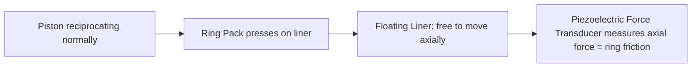

# Testing — Piston Assembly

## What Is Tested

Piston assembly testing covers: ring pack friction contribution, piston temperature
distribution, ring seal effectiveness (blowby), and piston mass properties.

---

## Piston Ring Friction Measurement

Ring friction is the largest single source of mechanical friction and the hardest
to isolate, because the piston, rings, and bore all interact.

### Floating Liner Method (Most Common)

The cylinder liner is mounted on a force transducer that is free to move axially.
The net axial force on the liner is the friction force from the ring pack:



**Equipment:** Kistler 9212 force sensor (range ±5 kN, resonant frequency > 3 kHz).
**Output:** friction force F(θ) at every crank angle.

**Accuracy:** ±2–5% of peak friction force. Main uncertainty: liner inertia correction
(the liner itself has mass and accelerates, creating an inertia force that must be
subtracted).

```
  F_friction(θ) = F_measured(θ) - m_liner × a_liner(θ)
```

### IMEP Subtraction Method (Simpler, Less Detailed)

Run the engine fired, then motor it (no combustion). The difference in IMEP between
the two conditions gives the net friction contribution across the cycle:

```
  FMEP = IMEP_fired - BMEP    (from dynamometer)
  or
  FMEP = IMEP_motored - PMEP  (pumping mean effective pressure)
```

This gives total friction but not the crank-angle-resolved signal.

---

## Piston Temperature Measurement

### Thermocouples

K-type thermocouples can be embedded in the piston crown and ring lands.
Running wires out is the challenge — two approaches:

1. **Slip rings:** electrical contacts on the crankshaft allow continuous temperature
   reading at all RPMs. Accuracy: ±2–3°C.
2. **Telemetry system:** miniature radio transmitter mounted on the piston sends
   temperature data wirelessly. Higher bandwidth, no slip ring drag.

**Typical locations:**
- Crown centre (highest temperature): 280–380°C at full load
- Top ring groove (must stay below ~180°C to prevent oil coking): 150–220°C
- Pin boss: 120–180°C

### Templugs (Melting Point Plugs)

Small plugs with a known melting point are embedded in the piston. After a test run
at controlled conditions, the piston is disassembled. Which plugs melted tells you
whether the temperature at that location exceeded the plug's rating.

A series of plugs with different melting points (e.g. 200, 220, 240, 260°C) brackets
the actual temperature. Cheap, simple, but gives only a range, not a continuous reading.

**Suppliers:** Temp-Plug (Temple), Thermex (RS Components).

### Thermal Paint / Liquid Crystal

Temperature-sensitive coatings change colour irreversibly at a threshold temperature.
Applied to the piston surface, they map the temperature distribution over an entire
surface rather than single points.

---

## Blowby Measurement

Blowby is the combustion gas that escapes past the ring pack into the crankcase.
It indicates ring seal quality and can reveal ring wear or damage.

```
  Instrument: Blowby flowmeter (e.g. Pierburg PLU-116)
  Location: crankcase ventilation outlet
  Measurement: volumetric flow rate [L/min]
  Typical values: 0.5–5 L/min (new engine), > 10 L/min (worn rings)
```

High blowby causes oil contamination, increases crankcase pressure, and raises HC
emissions from the PCV system.

---

## Piston Mass Measurement

Piston mass is measured on a precision balance:

- **Balance accuracy:** ±0.01 g (typical lab balance)
- **What is measured:** piston only, piston + pin, piston + pin + rings (for reciprocating mass calculation)
- **In engine sets:** all pistons must be within ±2–5 g of each other (production tolerance);
  racing pistons matched to ±0.5 g

The effective reciprocating mass (for inertia force calculation):
```
  m_recip = m_piston + m_pin + m_ring_pack + (1/3) × m_con_rod

  (The 1/3 con rod fraction is an approximation; exact value from modal analysis)
```

---

## Ring End Gap and Tension Measurement

- **Ring end gap:** measured with feeler gauges after inserting the ring into the
  bore and squaring it. Spec: ~0.25–0.45 mm for a new ring in a new bore.
- **Ring tangential tension:** measured on a ring compression tester. The force to
  compress the ring to its running diameter. Spec: typically 15–30 N for a top ring.

These determine the normal force on the bore wall, which directly sets ring friction.

---

## Key Accuracy Summary

| Measurement | Method | Typical uncertainty |
|---|---|---|
| Ring friction F(θ) | Floating liner | ±3–5% of peak |
| FMEP (total) | IMEP subtraction | ±2–5% |
| Piston crown temp | Thermocouple + telemetry | ±3–5°C |
| Piston mass | Precision balance | ±0.01 g |
| Ring end gap | Feeler gauge | ±0.01 mm |
| Blowby flow | Dedicated meter | ±2–5% |
