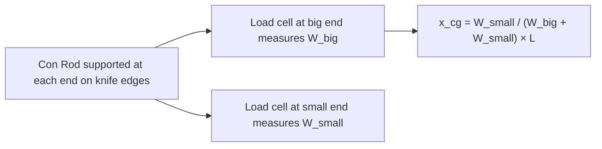

# Testing — Connecting Rod

## What Is Tested

Connecting rod testing covers: mass properties (mass, centre of gravity, moment
of inertia), dimensional accuracy, and structural integrity under dynamic loading.
In a running engine, telemetry can be used to measure bending and axial strain.

---

## Mass and Balance Measurement

### Total Mass

Measured on a precision balance: ±0.01 g.

Production tolerance: ±5 g from nominal.
Racing tolerance: ±0.5 g matched within a set.

### Centre of Gravity Location

The con rod mass is split into rotating (big end) and reciprocating (small end) fractions.
This is measured on a knife-edge balance:



From x_cg:
```
  m_rotating = m_total × x_cg / L    (big-end fraction)
  m_reciprocating = m_total - m_rotating    (small-end fraction)

  where L = centre-to-centre length
```

**Accuracy:** ±0.5–1% of mass split.

### Moment of Inertia

Measured by swinging the rod as a compound pendulum:

```
  I = m × g × d × (T/2π)²

  where:
    d = distance from pivot to CG
    T = period of oscillation
```

Or on a computerised inertia measurement machine (Sciemetric, AVERY).

---

## Dimensional Measurement

| Dimension | Instrument | Accuracy |
|---|---|---|
| Centre-to-centre length | Coordinate measuring machine (CMM) | ±2 µm |
| Big end bore diameter | Bore gauge | ±1 µm |
| Small end bore diameter | Bore gauge | ±1 µm |
| Big end bore roundness | CMM or roundness tester | ±0.5 µm |
| Twist and bend | CMM | ±5 µm/100 mm |
| Rod beam width/height | Micrometer | ±2 µm |

Big end bore roundness is critical — an out-of-round bore causes the bearing to
deform, compromising the hydrodynamic film and causing premature wear.

---

## Structural Testing

### Strain Gauge Measurement in a Running Engine

Telemetry strain gauges bonded to the rod beam measure bending and axial strain:

```
  Instrument: Micro Measurements (Vishay) CEA-06-125UN-350 gauge
  Signal: ±2 mV/V typical at peak load
  Transmission: slip rings on crankshaft or wireless telemetry (Hitec, Manner)
  Sampling: 50–100 kHz (10–20 samples per degree at 6000 RPM)
```

From the strain signal, axial force in the rod is calculated:
```
  F_axial = ε × E × A_beam_cross_section

  ε = strain [µm/m]
  E = Young's modulus (steel: 210 GPa)
  A = beam cross-sectional area
```

This is compared to the theoretically predicted F_gas - F_inertia to validate the
force model. Typical agreement: ±5–8%.

### Fatigue Testing (Component Level)

On a servo-hydraulic test rig, the rod is subjected to alternating tension-compression
cycles simulating the engine load spectrum:

```
  Max compression (power stroke, TDC): F_gas + F_inertia
  Max tension (exhaust/intake TDC): -F_inertia (inertia dominant)

  Load ratio R = F_min / F_max
  Test frequency: 20–100 Hz
  Target: 10^7 cycles (typical S-N curve endurance limit)
```

---

## Big End Bearing Measurement

After disassembly:
- **Bearing crush:** amount the shell stands proud of the housing bore — ensures correct clamping
- **Oil clearance:** difference between crankpin diameter and big end bore with shells installed. Spec: 0.025–0.065 mm.
- **Wear:** measure crankpin and shell after test. Allowable wear: 0.01 mm before replacement.

Oil clearance is measured with Plastigage (a crushable plastic strip — cheap, ±0.01 mm
accuracy) or a dial bore gauge (±1 µm accuracy).

---

## Key Accuracy Summary

| Measurement | Typical uncertainty |
|---|---|
| Total mass | ±0.01 g |
| CG location (x_cg/L) | ±0.5% |
| Centre-to-centre length | ±2 µm |
| Big end bore | ±1 µm |
| In-engine axial force | ±5–8% |
| Oil clearance | ±1 µm (bore gauge), ±10 µm (Plastigage) |
