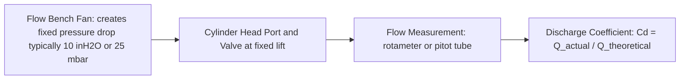

# Testing — Valve Train

## What Is Tested

Valve train testing covers: cam profile measurement, valve lift and timing verification,
discharge coefficient (flow capacity), and valve train dynamics (float, bounce, spring
force). These measurements calibrate the gas exchange model.

---

## Cam Profile Measurement

The cam lobe profile is the blueprint for valve lift. It must be measured precisely
because even small errors in the lift profile significantly affect volumetric efficiency.

### Coordinate Measuring Machine (CMM)

The camshaft is mounted in a CMM. A precision probe tip traverses the cam lobe surface.
Output: lobe radius r(α) as a function of cam angle α.

```
  From cam profile to valve lift:
  L(θ_crank) = r(α) - r_base_circle    where α = θ_crank / 2    (cam runs at half crank speed)
```

**Accuracy:** ±1 µm on lobe radius, ±0.02° on angular position.

### Optical Profile Measurement

Non-contact laser scanners (e.g. Renishaw REVO with scanning head) can measure the
full 3D cam surface at high speed and accuracy.

---

## Valve Lift Measurement

Valve lift L(θ) is measured directly on a running or motored engine:

### Displacement Sensor Method

A linear displacement sensor (LVDT or laser triangulation) is mounted coaxial with
the valve stem. Output: lift vs crank angle.

```
  Instrument: Kaman KD-2306 LVDT (±0.5 mm range, ±0.5 µm resolution)
  Sampling: angle-triggered (same DAQ as combustion analysis)
  Output: L(θ) at 0.1° resolution
```

This measures the actual valve lift in the running engine, including the effect of
cam follower clearance, oil film, and deflection.

### Derived Timing Events

From L(θ), the timing events IVO, IVC, EVO, EVC are identified as:
```
  IVO = θ at which lift exceeds threshold (e.g. 0.1 mm) on the opening side
  IVC = θ at which lift drops below threshold on the closing side
```

The threshold must be specified — different thresholds give different reported timings.
Most manufacturers specify timing at 0.5 mm or 1.0 mm lift (0.050" US convention).

---

## Flow Bench Testing (Discharge Coefficient)

A steady-state flow bench measures the volumetric flow rate through the intake or
exhaust port at a fixed pressure drop, for different valve lift positions.



### Discharge Coefficient

```
  Cd(L) = Q_measured / (A_curtain × v_ideal)

  A_curtain = π × D_valve × L    (valve curtain area at lift L)
  v_ideal = √(2ΔP / ρ)          (isentropic velocity for the test pressure drop)
```

Cd is a function of valve lift:
- At low lift (L/D < 0.05): Cd ≈ 0.5–0.7 (restricted by curtain area geometry)
- At high lift (L/D > 0.25): Cd ≈ 0.8–0.9 (port is the restriction)

**Equipment:** Superflow SF-750, SF-1020; Ricardo flow bench.
**Accuracy:** ±1–2% on Cd.

The Cd(L) table is the critical calibration data for the valve flow model in simulation.

---

## Valve Train Dynamics

### Valve Spring Force Measurement

The spring force vs compression curve is measured on a spring tester:

```
  F_spring(x) = k_spring × x + F_preload    (linear approximation)
  Typical: k ≈ 20–60 N/mm, F_preload ≈ 100–200 N
```

The installed preload (valve fully closed) determines the contact force at low RPM.

### High-Speed Photography / Laser Vibrometry

At high RPM (valve float region), a laser Doppler vibrometer measures the actual
valve velocity vs cam follower velocity:

```
  When valve velocity < follower velocity → valve has separated from the cam
  This defines the valve float RPM
```

**Equipment:** Polytec OFV-5000 vibrometer.

### Valve Timing Accuracy Assessment

Compare measured L(θ) against the nominal cam card (manufacturer spec):
- IVO/IVC: typically ±2–3° from nominal
- Lift accuracy: ±0.1–0.2 mm
- These errors are caused by cam timing chain/belt stretch, journal clearances

---

## Key Accuracy Summary

| Measurement | Instrument | Typical uncertainty |
|---|---|---|
| Cam lobe profile | CMM | ±1 µm radius, ±0.02° angle |
| Valve lift L(θ) | LVDT in-engine | ±0.05 mm |
| IVO/IVC (at 0.5 mm threshold) | From L(θ) | ±0.5° crank |
| Discharge coefficient Cd | Flow bench | ±1–2% |
| Spring rate | Spring tester | ±0.5% |
| Installed spring force | Spring tester + gap gauge | ±1 N |
