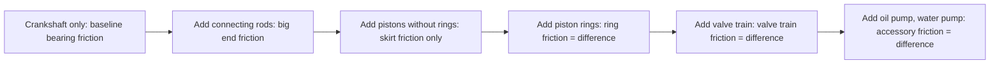

# Testing — Friction Losses

## What Is Tested

Friction testing isolates mechanical losses within the engine. These losses are the
difference between what the combustion gas delivers to the piston and what the
crankshaft actually provides. Accurate FMEP characterisation is essential for
matching simulated and measured BSFC.

---

## Motored Friction Test

The most common friction measurement: the engine is driven externally (no combustion)
by an AC electric motor. The power consumed to spin the engine equals the total
friction losses.

```
  FMEP_motored = τ_motoring × 2π / Vd_total    [Pa]

  τ_motoring = measured torque required to spin the engine
  No gas force, no combustion → measures friction + pumping only
```

**Conditions:**
- Oil at operating temperature (90°C) — cold friction is 2–3× higher
- Throttle wide open (WOT) to minimise pumping losses (so measured ≈ mechanical friction)
- Or: close throttle, measure, open throttle, measure — difference = pumping FMEP

**Equipment:** AC electric dyno (motoring capable), torque measurement, encoder.
**Accuracy:** ±2–4% on total FMEP.

### Fired vs Motored Difference

```
  FMEP_mechanical = IMEP_fired - BMEP - PMEP

  PMEP can be separated by running a fired test vs a motored test at the same RPM
  and MAP, then comparing the pumping loop areas on the P-V diagram
```

---

## Strip-Down Method (Component-Level)

Friction is measured incrementally by progressively adding components to the engine
and measuring the increase in motored torque:



Each step isolates one component's friction contribution.
**Accuracy:** ±3–5% per step (accumulated uncertainty from multiple measurements).

---

## Cycle-Resolved Friction (Floating Liner)

The floating liner method (described in [02-piston-assembly.md](02-piston-assembly.md))
gives the ring friction force F(θ) at every crank angle. For total engine friction
at crank-angle resolution:

**IMEP subtraction method (approximate):**
```
  F_total_friction(θ) ≈ [IMEP_fired - BMEP] / (stroke) + F_accessories
```

**Strain gauge method:** strain gauges on the connecting rod measure the rod force,
which equals F_gas - F_inertia. Subtracting the calculated theoretical force gives
the friction contribution that is unaccounted for.

---

## Chen-Flynn FMEP Correlation (Fitting to Test Data)

The measured FMEP data across RPM and load is fitted to the Chen-Flynn correlation
(see [10-friction-losses](../research-simulation/10-friction-losses.md)). The fitting
procedure:

```
  1. Measure FMEP at multiple RPM × load points (motored + fired tests)
  2. Compute peak cylinder pressure P_max at each point
  3. Fit linear regression: FMEP = A + B×P_max + C×v_mean + D×v_mean²
  4. Coefficients A, B, C, D are the Chen-Flynn constants for this engine
```

**Typical accuracy of fit:** R² > 0.97, residual < 5 kPa.

---

## Oil Temperature Effect on Friction

Friction varies strongly with oil temperature. A cold engine at 20°C has 2–3× higher
FMEP than at 90°C. The temperature sweep test:

```
  1. Start cold engine, record torque vs time as it warms up
  2. Record oil temperature simultaneously
  3. Plot FMEP vs T_oil → warm-up friction curve

  Typical curve:
  FMEP(20°C) ≈ 200–300 kPa
  FMEP(90°C) ≈ 80–120 kPa (production naturally aspirated)
```

This data is used to calibrate the viscosity-dependent friction model.

---

## Accessory Load Measurement

Individual accessory power consumption:

| Accessory | Measurement method | Typical loss |
|---|---|---|
| Oil pump | Measure torque on pump drive before/after disconnecting pump | 0.5–2 kW |
| Water pump | Same — or calorimetric | 0.5–2 kW |
| Alternator | Electrical output / efficiency | 0.5–1.5 kW |
| A/C compressor | Clutch engage/disengage torque step | 2–6 kW |

---

## Key Accuracy Summary

| Measurement | Method | Typical uncertainty |
|---|---|---|
| Total FMEP (warm) | Motored dyno | ±3–5% |
| Ring friction F(θ) | Floating liner | ±3–5% of peak |
| Component friction (strip-down) | Step-by-step motored | ±5–10% per component |
| FMEP vs temperature | Warm-up torque trace | ±5% |
| Accessory load | Drive disconnection | ±5–10% |
