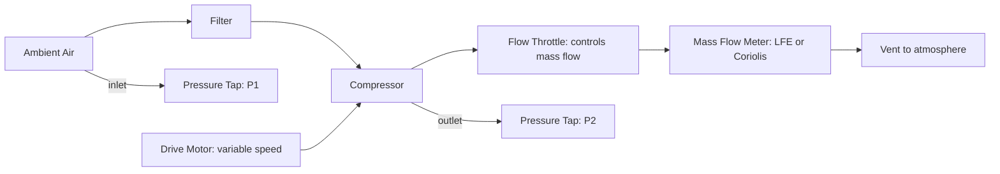

# Testing — Forced Induction

## What Is Tested

Forced induction testing characterises the turbocharger or supercharger: boost pressure,
compressor map, turbine response, wastegate behaviour, and intercooler effectiveness.
This data is essential for calibrating the turbo simulation and matching boost vs RPM curves.

---

## Boost Pressure Measurement

```
  Instrument: Kistler 4045 piezoresistive transducer (absolute)
  Location: intake manifold plenum (after intercooler, before throttle)
  Range: 0–4 bar absolute
  Accuracy: ±0.2 kPa
  Sampling: both time-based (for boost control) and angle-triggered (for transient analysis)

  Typical values:
  Idle: 0.9–1.0 bar (below atmospheric due to throttle restriction)
  Cruise: 1.0–1.5 bar (slight boost or atmospheric)
  WOT target boost: 1.5–3.5 bar depending on design
```

---

## Turbocharger Speed Measurement

Turbo speed is measured without disassembly using a microwave or eddy current
proximity sensor through the compressor housing:

```
  Instrument: Acuity non-contact speed sensor, or Micro-Epsilon eddyNCDT
  Output: pulses per blade pass × blade count = RPM
  Blade count: typically 5–9 compressor blades
  Range: 0–300,000 RPM
  Accuracy: ±0.5%
```

Turbo speed combined with boost pressure and air temperature confirms whether the
turbo is operating within its compressor map boundary (avoiding surge and choke).

---

## Compressor Map Measurement

The compressor map is measured on a **gas stand** (dedicated compressor test rig)
before engine installation:



For each turbo speed (set by drive motor), measure:
- Mass flow rate ṁ
- Pressure ratio: PR = P2/P1
- Compressor outlet temperature T2

Isentropic efficiency:
```
  η_c = (T2_isentropic - T1) / (T2_actual - T1)

  T2_isentropic = T1 × PR^((γ-1)/γ)
```

**Accuracy:** ±1% on efficiency, ±0.5% on pressure ratio, ±0.3% on mass flow.

The resulting map (PR vs ṁ at multiple speeds, with efficiency islands) is the
primary calibration input for the turbo simulation.

---

## Turbine Map Measurement

Similarly, the turbine map is measured on the gas stand:

```
  Input: hot gas at known P, T, and ṁ
  Measurement: turbine outlet pressure P4, outlet temperature T4, shaft power
  Turbine efficiency: η_t = actual shaft power / isentropic expansion power
```

In practice, turbine maps are often provided by the turbocharger manufacturer and
measured on their own hot gas stands.

---

## Wastegate Testing

The wastegate opening pressure and flow coefficient are characterised:

```
  Method: build up boost pressure slowly → record pressure at which wastegate cracks open
  Actuator preload: typically 0.8–1.5 bar boost (spring-loaded actuators)

  Flow test: measure bypass flow rate vs pressure differential at various valve positions
  Output: Cd × A_WG(position) — the wastegate equivalent orifice area
```

ECU-controlled (electronic) wastegates are characterised with duty cycle sweeps:
```
  At each duty cycle (0–100%), record boost pressure at steady state
  → map duty cycle to effective boost
```

---

## Intercooler Effectiveness Test

```
  Method: measure temperature before and after intercooler at constant airflow
  Input: hot compressed air at known temperature T_in, flow rate ṁ
  Output: T_out after intercooler, pressure drop ΔP_intercooler

  Effectiveness: ε = (T_in - T_out) / (T_in - T_coolant_air)
  Pressure drop: ΔP_intercooler [kPa] at rated flow

  Typical:
    ε ≈ 0.70–0.85 (air-to-air)
    ΔP_intercooler ≈ 10–30 kPa at WOT flow (parasitic loss)
```

---

## Turbo Transient Response (Spool-Up Test)

Measured by a rapid throttle step from closed to WOT on the engine dyno:

```
  t = 0: throttle steps to WOT
  t = t_lag: boost pressure begins rising significantly
  t = t_full: boost reaches target pressure

  Measurement: boost pressure transducer at 1 kHz, simultaneously
               turbo speed sensor

  Typical: t_lag = 0.2–0.8 s, t_full = 1.0–3.0 s (depending on turbo size and RPM)
```

---

## Key Accuracy Summary

| Measurement | Instrument | Typical uncertainty |
|---|---|---|
| Boost pressure | Piezoresistive transducer | ±0.2 kPa |
| Turbo speed | Proximity sensor | ±0.5% |
| Compressor efficiency η_c | Gas stand | ±1% |
| Pressure ratio PR | Gas stand | ±0.5% |
| Mass flow rate | LFE or Coriolis | ±0.3% |
| Intercooler effectiveness | Temperature measurement | ±2% |
| Wastegate opening pressure | Actuator bench test | ±0.05 bar |
