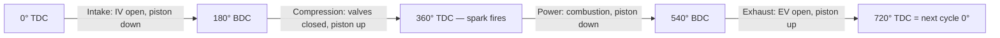
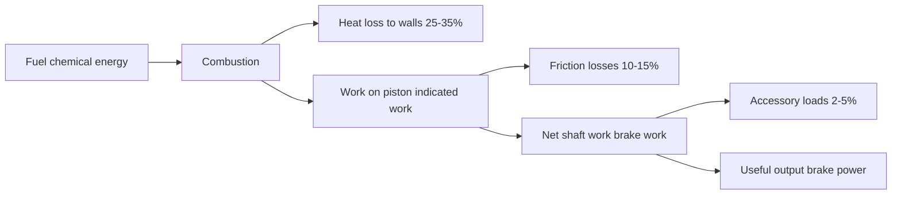
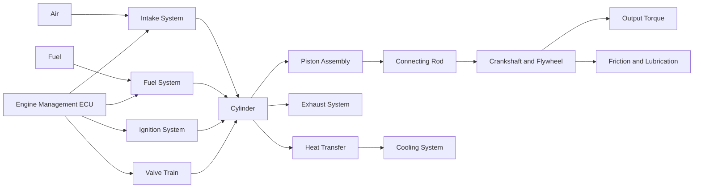

# Engine Architecture — Overview

## What an Engine Is

An internal combustion engine (ICE) converts the chemical energy stored in fuel into
rotational mechanical work. It does this by burning a fuel-air mixture inside a sealed
cylinder, using the resulting pressure rise to push a piston, which in turn rotates a
crankshaft through a connecting rod.

The "internal" in ICE means combustion happens inside the working cylinder itself —
as opposed to a steam engine, where combustion heats water externally.

---

## The 4-Stroke Otto Cycle

A 4-stroke gasoline engine completes one thermodynamic cycle every **two crankshaft
revolutions** (720° of crank angle). The four strokes are:

| Crank | Stroke | Valves | What happens |
|---|---|---|---|
| 0°–180° | Intake | IV open | Piston descends, fresh charge drawn in |
| 180°–360° | Compression | both closed | Piston ascends, mixture compressed |
| 360°–540° | Power | both closed | Spark fires, combustion pushes piston down |
| 540°–720° | Exhaust | EV open | Piston ascends, burned gases expelled |

TDC (Top Dead Centre) is at 0° and 360°. BDC (Bottom Dead Centre) is at 180° and 540°.
The power stroke delivers the only net work output; the other three are parasitic strokes.

---

## The 4-Stroke Cycle (Mermaid)



---

## Energy Flow



Typical thermal efficiency for a naturally aspirated gasoline engine: **30–38%**.
Diesel: **42–50%**. The remainder leaves as heat via exhaust, coolant, and radiation.

---

## Major Subsystems



| Subsystem | Function | Key parameters |
|---|---|---|
| Combustion chamber | Geometry that contains the working gas | Bore, stroke, CR |
| Piston assembly | Transfers gas force to con rod | Mass, rings, pin |
| Connecting rod | Converts linear to rotary motion | Length, lambda ratio |
| Crankshaft & flywheel | Rotary output, energy storage | Inertia, throw |
| Valve train | Controls gas exchange timing | IVO/IVC/EVO/EVC, lift |
| Intake system | Delivers fresh air charge | Throttle, manifold, ports |
| Fuel system | Meters and atomises fuel | AFR, injection type |
| Ignition system | Initiates combustion | Spark advance, knock |
| Thermodynamics | Heat → work conversion | Otto cycle, Wiebe model |
| Friction | Mechanical losses | FMEP, ring/bearing friction |
| Heat transfer | Thermal management | Wall model, coolant |
| Exhaust system | Removes spent gases, energy recovery | Pulses, headers, scavenging |
| Lubrication | Reduces friction, removes heat | Oil circuit, viscosity |
| Cooling system | Maintains temperature limits | Coolant, radiator |
| Forced induction | Increases air density | Turbo, supercharger, intercooler |
| Engine management | Closed-loop control | ECU, fuel/ignition maps |
| Multi-cylinder | Balance, smoothness, power density | Firing order, configuration |

---

## The Universal Variable: Crank Angle

Every event in an engine is expressed as an angle of the crankshaft. Crank angle
θ is the master clock. For a 4-stroke engine, one complete thermodynamic cycle
spans 720° (two crankshaft rotations).

Crank angle relates to time via RPM:

```
  ω = 2π × RPM / 60     [rad/s]

  At 3000 RPM:   ω = 314 rad/s   →  1° = 55 µs
  At 6000 RPM:   ω = 628 rad/s   →  1° = 28 µs
```

**Simulation implication:** step size is expressed in degrees (e.g. 0.1°–1° per step).
Smaller steps improve accuracy at high RPM where the piston covers more distance per degree.

---

## Key Engine Metrics

### Displacement Volume
```
  Vd = (π/4) × bore² × stroke × N_cylinders    [m³]
```

### Compression Ratio
```
  CR = (Vd_single + Vc) / Vc

  Vc = clearance volume (volume at TDC)
```
Typical gasoline: CR 9–13. Diesel: CR 14–23.

### Torque and Power
```
  Power P [W]  = τ [N·m] × ω [rad/s]
  Power P [kW] = τ [N·m] × RPM / 9549
```

### BMEP — Brake Mean Effective Pressure
Normalised torque, independent of engine size:
```
  BMEP = (2π × τ_brake × n_strokes) / Vd_total    [Pa]
  n_strokes = 2 for 4-stroke
```
Naturally aspirated gasoline: ~10–13 bar. Turbocharged: ~20–30 bar. Diesel: ~18–25 bar.

### Volumetric Efficiency
How well the intake system fills the cylinder:
```
  ηv = actual_air_mass / (ρ_ambient × Vd_single)
```
High-performance NA engines: ~95–105% (ram tuning). Restricted throttle: < 50%.

### Indicated vs Brake
- **Indicated power** — computed from in-cylinder P-V work (gas side)
- **Brake power** — measured at output shaft (after internal friction)
- **FMEP** = IMEP − BMEP (the friction tax)

### Brake Specific Fuel Consumption (BSFC)
```
  BSFC = ṁ_fuel / P_brake    [g/kWh]
```
Good NA gasoline: ~250–280 g/kWh. Diesel: ~200–220 g/kWh.

---

## 2-Stroke vs 4-Stroke

This document covers 4-stroke engines. In a 2-stroke engine:
- Intake and exhaust happen simultaneously around BDC (no separate strokes)
- Power stroke every revolution → higher power density, simpler mechanism
- Worse fuel economy and emissions (unburned mixture exits exhaust port)
- Common in small engines, motorcycles, marine outboards

---

## Diesel vs Gasoline (Otto)

| Attribute | Otto (gasoline) | Diesel |
|---|---|---|
| Ignition | Spark (timed) | Compression autoignition |
| Compression ratio | 9–13 | 14–23 |
| Throttle | Throttle body (pumping loss) | Unthrottled (quantity control) |
| Knock | Limits CR and timing | Not a fundamental limit |
| Thermal efficiency | 30–38% | 42–50% |

---

## Component Files

- [01-combustion-chamber.md](01-combustion-chamber.md)
- [02-piston-assembly.md](02-piston-assembly.md)
- [03-connecting-rod.md](03-connecting-rod.md)
- [04-crankshaft-flywheel.md](04-crankshaft-flywheel.md)
- [05-valve-train.md](05-valve-train.md)
- [06-intake-system.md](06-intake-system.md)
- [07-fuel-system.md](07-fuel-system.md)
- [08-ignition-system.md](08-ignition-system.md)
- [09-thermodynamics.md](09-thermodynamics.md)
- [10-friction-losses.md](10-friction-losses.md)
- [11-heat-transfer.md](11-heat-transfer.md)
- [12-exhaust-system.md](12-exhaust-system.md)
- [13-lubrication.md](13-lubrication.md)
- [14-cooling-system.md](14-cooling-system.md)
- [15-forced-induction.md](15-forced-induction.md)
- [16-engine-management.md](16-engine-management.md)
- [17-multi-cylinder.md](17-multi-cylinder.md)
