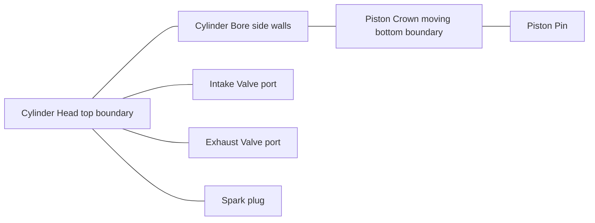
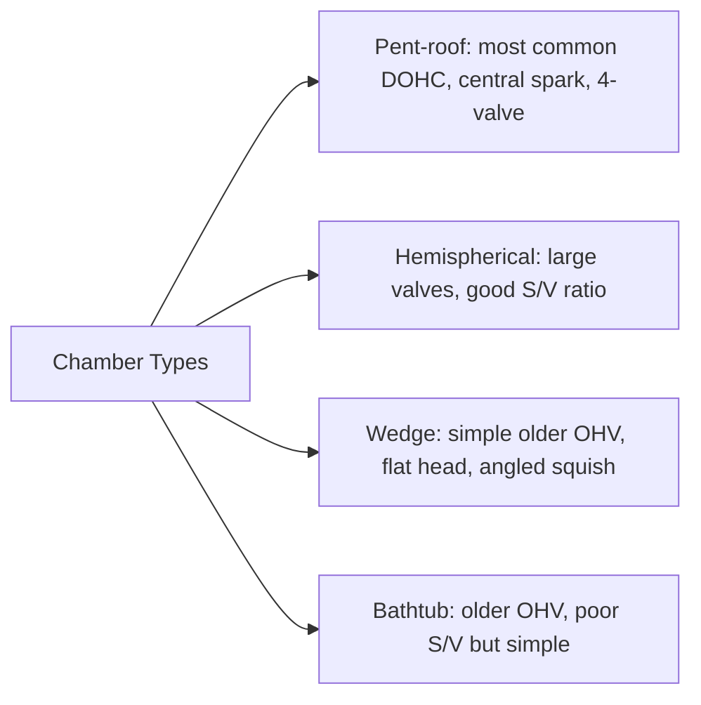

# Combustion Chamber

## What It Is

The combustion chamber is the sealed space above the piston at TDC where the
fuel-air mixture is compressed and burned. Its geometry directly controls the
compression ratio, combustion speed, knock tendency, and heat losses.

Everything else in the engine exists to get fresh charge into this space,
burn it efficiently, and extract the resulting work.

---

## Anatomy



### Key Dimensions

| Parameter | Symbol | Typical range (gasoline) | Unit |
|---|---|---|---|
| Bore | B | 65–100 mm | m |
| Stroke | S | 60–100 mm | m |
| Con rod length | L | 120–160 mm | m |
| Clearance volume | Vc | 50–80 cm³ | m³ |
| Compression ratio | CR | 9–13 | — |

---

## Geometry Formulas

### Piston Area
```
  A_piston = (π / 4) × B²
```
This is the effective area that gas pressure acts on. Directly determines gas force
for a given cylinder pressure.

### Swept (Displacement) Volume per Cylinder
```
  Vd = A_piston × S = (π / 4) × B² × S
```
The volume the piston sweeps from BDC to TDC. Measured in litres or cm³ in practice.

### Clearance Volume
The volume remaining when the piston is at TDC (dead volume that cannot be swept):
```
  Vc = Vd / (CR - 1)
```

### Total Cylinder Volume at Any Crank Angle
The instantaneous volume depends on piston position x(θ) from TDC:
```
  V(θ) = Vc + A_piston × x(θ)

  x(θ) = r(1 - cosθ) + L - √(L² - r²sin²θ)

  where:
    r = S/2         (crank throw radius)
    L = con rod length
    θ = crank angle from TDC (0 at TDC, π at BDC)
```
The exact formula accounts for the oblique angle of the connecting rod (the √ term).
A first-order approximation drops the second-order term:
```
  x(θ) ≈ r(1 - cosθ)    [first-order; valid for L >> r]
```

---

## Compression Ratio

### Definition
```
  CR = V_max / V_min = (Vd + Vc) / Vc
```
V_max = volume at BDC. V_min = volume at TDC = Vc.

### Effect on Thermal Efficiency
For an ideal Otto cycle, thermal efficiency depends only on CR:
```
  η_Otto = 1 - 1 / CR^(γ-1)

  γ ≈ 1.4 for air

  CR = 10  →  η ≈ 60.2% (theoretical ideal)
  CR = 12  →  η ≈ 62.9%
```
Real engines achieve ~50–65% of the theoretical ideal due to heat loss, combustion
duration, real gas properties, and friction.

### Knock Constraint
Higher CR → higher end-gas temperature after compression → increased knock risk.
Knock limits practical CR in gasoline engines. High-octane fuel allows higher CR.
Diesel uses high CR (14–23) because it relies on compression autoignition.

### Geometric vs Effective CR
The effective CR is lower than the geometric CR because the intake valve closes
after BDC (IVC is typically 40–60° after BDC). The gas trapped is compressed from
a smaller volume:
```
  CR_effective ≈ V(IVC) / Vc
```
Late IVC is used intentionally in performance engines (Miller/Atkinson cycle) to
reduce pumping work at partial load.

---

## Bore/Stroke Ratio

```
  ratio = B / S
```

| Ratio | Character | Typical application |
|---|---|---|
| B/S < 1 (undersquare / long-stroke) | High torque at low RPM, lower piston speed at same RPM | Diesel, truck engines |
| B/S = 1 (square) | Balanced | General purpose |
| B/S > 1 (oversquare / short-stroke) | High RPM capability, large valve area | Sports engines, F1 |

Oversquare allows larger valves (diameter limited by bore), improving breathing at
high RPM. Mean piston speed is lower for the same RPM, reducing mechanical stress.

### Mean Piston Speed
```
  v_mean = 2 × S × RPM / 60    [m/s]
```
Practical limit: ~20–25 m/s for production engines, up to ~30 m/s in racing.
Above this, ring and bearing stress, lubrication breakdown, and valve float become
critical.

---

## Chamber Shape and Combustion Quality

The shape of the combustion chamber affects:

1. **Flame travel distance** — distance from spark plug to the farthest point of the
   unburned mixture (the "end gas"). Shorter distance → less time for autoignition
   → knock resistance.

2. **Swirl and tumble** — in-cylinder charge motion that improves mixing and flame speed.

3. **Surface-to-volume ratio** — higher S/V → more heat loss to walls → lower efficiency.
   Compact chambers (pent-roof, hemispherical) have lower S/V than flat-head designs.

### Common Chamber Types



The pent-roof 4-valve design with a central spark plug is the dominant modern choice:
it minimises flame travel distance, allows large valves for breathing, and produces
good squish (turbulence from the squish zone near the head gasket surface).

---

## Squish and Tumble

**Squish** is turbulent charge motion caused by the piston crown approaching a
closely-machined flat area of the head (squish band). As clearance drops to ~1–2 mm
near TDC, the charge is forcibly ejected inward at high velocity, promoting mixing.

**Tumble** is a barrel-roll vortex of intake charge that persists through compression
and breaks down into fine-scale turbulence near TDC, accelerating flame propagation.

Both increase flame speed, reducing the combustion duration and improving knock resistance.

---

## Simulation Notes

To simulate the combustion chamber you need:

- `bore`, `stroke` → computes Vd, A_piston
- `con_rod_length` → needed for accurate V(θ) via the full geometry formula
- `compression_ratio` → sets Vc, which sets the peak pressure after compression
- `crank_angle` → needed to compute V(θ) at each simulation step

Heat loss requires knowing the **instantaneous surface area** of the chamber,
which changes with piston position — this is needed for heat transfer models
(see [11-heat-transfer.md](11-heat-transfer.md)).
