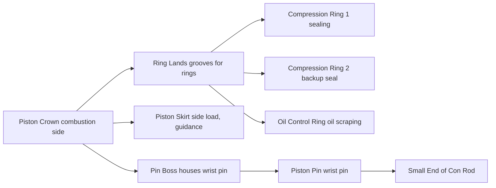

# Piston Assembly

## What It Is

The piston is the moving wall of the combustion chamber. It receives the force of
combustion and transmits it to the connecting rod. It also serves as a thermal
barrier and a sealing component between the hot combustion gas and the crankcase.

The piston assembly consists of: the piston body, the ring pack, and the piston pin
(wrist pin / gudgeon pin).

---

## Anatomy



---

## The Piston Crown

The crown is the top face — it sees peak gas pressures (~50–150 bar) and temperatures
(~300–400°C at the surface). Its shape is chosen to:

1. **Match the combustion chamber shape** — a dished crown with a pent-roof head
   creates a compact, centrally-located combustion zone
2. **Create squish** — a flat peripheral band on the crown pairs with the flat squish
   zone on the head, generating turbulence near TDC
3. **Minimise crevice volume** — the gap between the ring pack and head gasket traps
   unburned mixture that escapes combustion (HC emissions source)

### Crown Profiles

| Type | Description | Application |
|---|---|---|
| Flat | Simple, minimal crevice volume | Gasoline with pent-roof head |
| Dished | Bowl-shaped recess | Direct-injection diesel (fuel spray targets dish) |
| Domed | Raised crown | Old hemispherical chambers, high-CR gasoline |
| Gas-ported | Small channels to 1st ring groove | Racing only — dangerous if over-pressured |

---

## The Ring Pack

Three rings fit into grooves machined into the piston. From top to bottom:

### Ring 1 — Top Compression Ring
- Primary gas seal. Prevents combustion pressure from escaping past the piston.
- Sees the highest pressure and temperature.
- Made from cast iron or ductile iron, often chrome or nitrided coated.
- Ring gap: ~0.2–0.4 mm when hot. If too small, thermal expansion causes ring seizure.

### Ring 2 — Second Compression Ring
- Backup gas seal. Also scrapes oil from the bore on the downstroke.
- Lower gas pressure load than ring 1.
- Taper-face profile to act as a one-way oil scraper.

### Ring 3 — Oil Control Ring
- Scrapes excess oil from the bore walls on the downstroke, returning it to the sump.
- Critical for oil consumption control.
- Multi-piece construction with rail rings and an expander spring.
- Spring force keeps rails in contact with the bore under all conditions.

### Ring Friction
Each ring presses against the bore wall. The radial force generates friction:
```
  F_ring = tangential_tension × 2 × π × (bore / 2) / bore    (simplified)
```
Ring friction is the single largest source of mechanical friction in a typical engine,
especially at low temperatures when oil viscosity is high.

---

## The Piston Pin (Wrist Pin / Gudgeon Pin)

A hollow cylindrical pin that pivots in the pin boss of the piston and connects to
the small end of the connecting rod.

### Retention Methods
- **Full-floating:** pin rotates in both the piston boss and the con rod small end.
  Retained axially by circlips. Common in performance engines — more compliant.
- **Press-fit:** pin is interference-fit into the con rod small end. Only rotates
  in the piston boss. Common in low-cost production engines.

### Pin Forces
The pin must transmit the full gas force minus the inertia force of the piston:
```
  F_pin ≈ F_gas - F_inertia_piston

  F_inertia_piston = m_piston × a_piston
```
At high RPM, piston acceleration near TDC is enormous. At 8000 RPM with 86 mm stroke:
```
  a_TDC ≈ ω² × r × (1 + λ)    where λ = r/L (lambda ratio)
  ω = 8000 × 2π/60 ≈ 838 rad/s
  r = 0.043 m
  a_TDC ≈ 838² × 0.043 × (1 + 0.3) ≈ 39,000 m/s² ≈ 4000 g
```
A 350 g piston at 4000 g generates ~1370 N of inertia force — comparable to gas forces
at high RPM, and in the opposite direction (trying to pull the piston away from the rod).

---

## Piston Skirt

The skirt is the cylindrical body below the ring pack. It:
- Guides the piston laterally in the bore (prevents tilting)
- Transmits the **side load** from the connecting rod angle to the bore wall
- Must be slightly smaller than the bore (clearance: ~0.02–0.05 mm when hot)

### Side Force
When the con rod is at an angle (any point other than TDC/BDC), a lateral component
of the rod force is generated:
```
  F_side = F_piston × tan(β)

  where β = asin(r × sinθ / L)    (con rod angle)
```
This force changes sign twice per revolution, causing the piston to rock against
alternate sides of the bore — this is the mechanical knock sound ("piston slap").

### Thermal Expansion
Pistons run hot (~250°C at the crown, ~150°C at the skirt) and expand significantly.
The bore clearance is specified at cold assembly conditions. Running clearance is
designed to allow for thermal expansion without seizure.

Pistons are often slightly oval at room temperature — machined to allow for differential
expansion between the thrust face and the pin boss axis.

---

## Piston Mass and Inertia

Total reciprocating mass:
```
  m_recip = m_piston + m_pin + m_ring_pack + m_con_rod_small_end

  Simplified: m_recip ≈ m_piston + (1/3) × m_con_rod
```
(The 1/3 factor is a standard engineering approximation: roughly 1/3 of the con rod
mass reciprocates with the piston, 2/3 rotates with the crankpin.)

Reducing piston mass allows higher RPM and reduces bearing loads. Racing pistons are
made from forged aluminium alloys (2618, 4032) and are often hypereutectic silicon
aluminium. Production pistons are cast aluminium.

---

## Simulation Notes

For a piston assembly simulation you need:

- `piston_mass` — contributes to reciprocating inertia
- `bore` — piston area for gas force calculation, ring/bore interaction
- `stroke`, `con_rod_length` — set the kinematic acceleration profile
- Ring friction model: ring normal force × friction coefficient × bore area
  (see [10-friction-losses.md](10-friction-losses.md))
- Piston temperature affects ring gap, clearance, and oil film viscosity
  (see [11-heat-transfer.md](11-heat-transfer.md))
