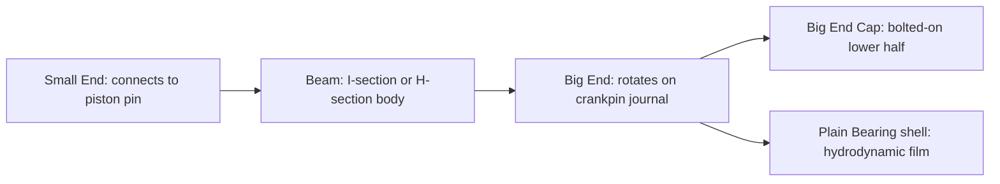

# Connecting Rod

## What It Is

The connecting rod (con rod) is the link between the linearly-reciprocating piston
and the rotating crankshaft. It converts linear piston motion into rotational
crankshaft motion. The challenge of its design is that it must handle both large
tensile loads (gas pressure) and large compressive loads (inertia), while being as
light as possible to reduce reciprocating mass.

---

## Anatomy



---

## Key Dimensions

| Parameter | Symbol | Typical range | Unit |
|---|---|---|---|
| Con rod length (centre-to-centre) | L | 120–160 mm | m |
| Crank throw (half stroke) | r = S/2 | 30–50 mm | m |
| Lambda ratio | λ = r/L | 0.25–0.35 | — |

---

## The Lambda Ratio (r/L)

The lambda ratio is the most important parameter governing the kinematics of the
crank-slider mechanism:

```
  λ = r / L    (dimensionless, also called the crank-to-rod ratio)
```

### Effects of Lambda

**Lower λ (longer rod):**
- More time near TDC at peak pressure → more torque extracted
- Smaller con rod angle → less side force on piston → less bore wear
- Reduced secondary inertia forces
- Engine is physically taller, heavier, harder to package

**Higher λ (shorter rod):**
- More aggressive piston acceleration
- Greater secondary force (runs at 2× the firing frequency)
- More side force → more friction and bore wear
- More compact engine

Typical production compromise: λ = 0.27–0.32.

---

## Kinematics: Piston Position

Given crank angle θ from TDC (0 at TDC, π at BDC):

```
  x(θ) = r(1 - cosθ) + L - √(L² - r²sin²θ)
```

This can be expanded using the binomial approximation (valid for small λ):

```
  x(θ) ≈ r[(1 - cosθ) + (λ/2)(1 - cos2θ)]
```

The first term is the **primary** component (at crankshaft frequency).
The second is the **secondary** component (at 2× crankshaft frequency, hence
harder to balance).

### Piston Velocity

```
  v(θ) = dx/dt = dx/dθ × dθ/dt = ω × dx/dθ

  dx/dθ ≈ r[sinθ + (λ/2)sin2θ]

  v(θ) ≈ ω × r × [sinθ + (λ/2)sin2θ]
```

### Piston Acceleration

```
  a(θ) = ω² × r × [cosθ + λ cos2θ]
```

At TDC (θ = 0):
```
  a_TDC = ω² × r × (1 + λ)    [maximum, positive — piston decelerating]
```

At BDC (θ = π):
```
  a_BDC = -ω² × r × (1 - λ)   [negative — piston decelerating]
```

The acceleration at TDC is always larger in magnitude than at BDC because of the
secondary term. This asymmetry is why primary balance can be achieved but secondary
balance is more difficult.

---

## Force Analysis

### Gas Force on Piston
```
  F_gas = (P_cyl - P_amb) × A_piston    [N, positive = down toward crank]
```

### Inertia Force (Reciprocating)
```
  F_inertia = -m_recip × a(θ)
```
At TDC during combustion: F_gas is large and positive (pushing down), F_inertia is
large and negative (pulling piston up). The net force is what the rod carries.

### Con Rod Angle
```
  sinβ = (r / L) × sinθ = λ sinθ

  β = arcsin(λ sinθ)
```

Maximum angle β_max ≈ arcsin(λ) ≈ 17° for λ = 0.3.

### Converting Piston Force to Crankshaft Torque
The piston force F_piston = F_gas + F_inertia acts along the cylinder axis.
Converting to torque on the crankpin:

```
  τ = F_piston × r × sin(θ + β) / cos(β)
```

This is the lever arm formula for the slider-crank mechanism. The effective moment arm
varies continuously with θ, which is why engine torque is never smooth from a single
cylinder.

---

## Loading Modes

The con rod operates in alternating loading modes:

| Crank position | Gas force | Inertia force | Net rod load |
|---|---|---|---|
| TDC (power) | Large compression (pushes rod down) | Large tension (pulls piston up) | Net compression — large |
| BDC | Near zero | Tension (piston overshooting) | Tension |
| TDC (exhaust/intake) | Near zero (no combustion) | Large tension | Pure tension |

At high RPM, the inertia-driven tension at TDC on the exhaust stroke can exceed the
combustion compressive load and is the dimensioning load for the con rod bolts.

---

## Materials and Construction

| Application | Material | Comment |
|---|---|---|
| Production | Cast iron, cast steel | Fracture-split big end for precise cap registration |
| Performance | Forged steel (4340, H-beam) | Higher strength, heat treated |
| Racing / lightweight | Titanium, aluminium, MMC | Very expensive, limited life |

**Fracture splitting** (cracking) the big end is now standard on production engines:
the cap is cracked apart deliberately so the fracture surface mates perfectly,
eliminating machining tolerances.

---

## Simulation Notes

For a connecting rod simulation you need:

- `con_rod_length` L — the dominant kinematic parameter
- `stroke` S → r = S/2 — crankpin radius
- `con_rod_mass` — split into reciprocating (~2/3) and rotating (~1/3) fractions
- Lambda ratio λ = r/L — controls secondary force magnitude
- Full kinematics: x(θ), v(θ), a(θ) using the exact or approximate formulas above
- Torque conversion: τ = F_piston × r × sin(θ + β) / cos(β)

The approximate formulas are adequate for simulation (error < 1% for λ < 0.35).
