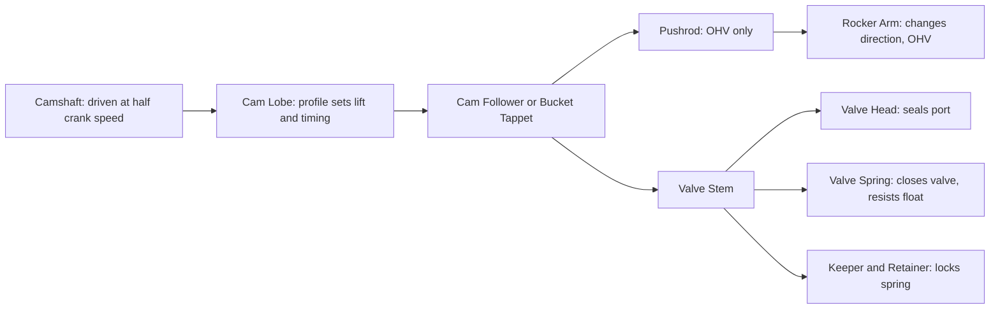
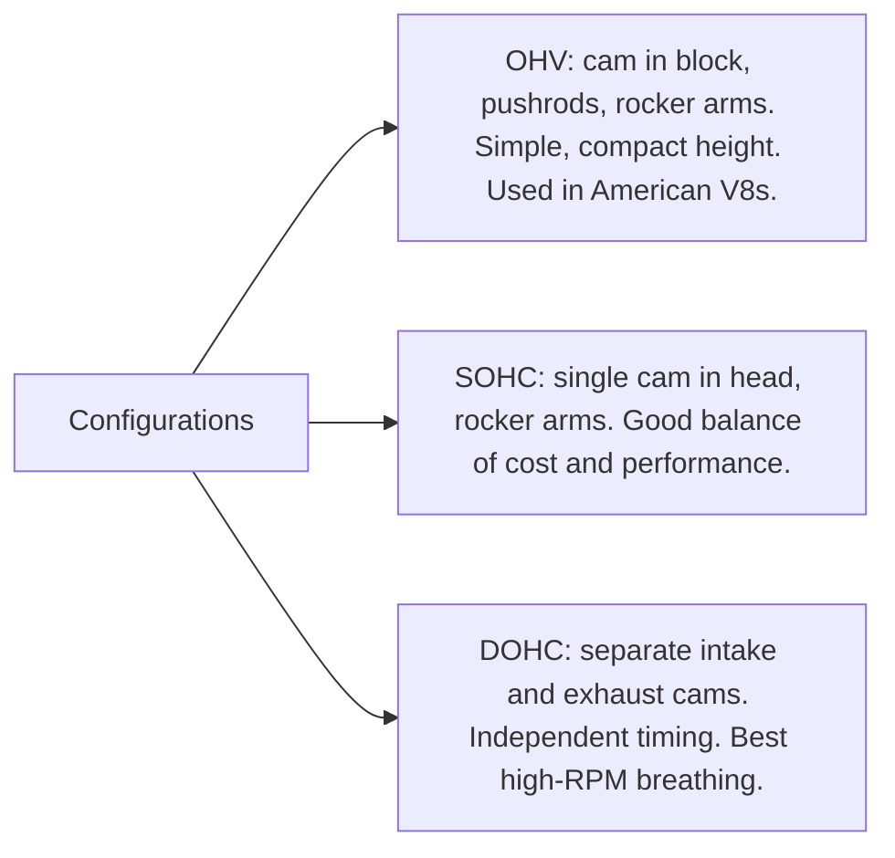
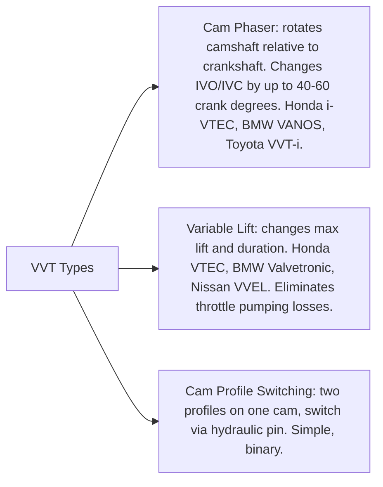

# Valve Train

## What It Is

The valve train controls when and how much the intake and exhaust valves open and
close. It is the gatekeeper for gas exchange — it determines how much fresh charge
enters the cylinder and how thoroughly burned gases are expelled. Valve timing is
one of the most powerful levers for tuning engine behaviour across the RPM range.

---

## Anatomy



In a DOHC (Dual Overhead Cam) engine, the cam acts directly on a bucket tappet
or finger follower — no pushrods or rocker arms needed. Fewer parts, less mass,
better high-RPM behaviour.

---

## Valve Train Configurations



---

## Timing Events

All valve events are expressed as crank angle degrees (not cam degrees). Because the
cam runs at half crank speed, 1° of cam = 2° of crank.

### Key Events

| Event | Abbreviation | Reference | Typical range |
|---|---|---|---|
| Intake Valve Open | IVO | Degrees before TDC (intake) | 5°–20° BTDC |
| Intake Valve Close | IVC | Degrees after BDC | 30°–60° ABDC |
| Exhaust Valve Open | EVO | Degrees before BDC | 35°–65° BBDC |
| Exhaust Valve Close | EVC | Degrees after TDC (exhaust) | 5°–20° ATDC |

### The 720° Valve Map (single cylinder, 4-stroke)

```
  Crank °     Stroke         IVO  IVC        EVO  EVC
  ────────    ────────────   ─────────────────────────
  0           Intake TDC     → IVO (valve opens)
  0–180       Intake         [intake open             ]
  180         BDC
  180–220ish  (IVC region)   IVC →
  220–360     Compression    [both closed             ]
  360         TDC power
  360–540     Power stroke   [both closed             ]
  460ish      (EVO region)            EVO →
  460–540     BDC approach   [exhaust open            ]
  540         BDC
  540–720     Exhaust        [exhaust open            ]
  700ish      overlap zone   → IVO   EVC →
  720/0       Exhaust TDC
```

**Valve overlap** is the period when both intake and exhaust valves are open
simultaneously, around TDC of the exhaust stroke. This scavenging effect uses
exhaust momentum to help draw fresh charge in — very effective at high RPM,
but can cause problems at idle.

---

## Lift Profile

The cam lobe shape defines the valve lift as a function of crank angle. Common profiles:

### Sinusoidal Approximation
A simple model: zero outside the open window, sinusoidal within it:
```
  lift(θ) = L_max × sin(π × (θ - θ_open) / (θ_close - θ_open))
             for θ_open ≤ θ ≤ θ_close, else 0
```
This captures the smooth opening and closing behaviour. It is the standard
approach for simulation when the exact cam profile is unknown.

### Polynomial Profiles
Real cam profiles use polynomial segments (typically 5th or 7th order) to
satisfy boundary conditions:
- Zero lift and zero velocity at open and close
- Zero acceleration at open and close (for jerk control)
- Maximum lift at the midpoint

### Polydyne Profiles
Advanced cam designs include dynamic correction for the elasticity of the valve train
— the cam shape is modified to produce the desired valve motion after accounting for
deflections in the follower and spring.

---

## Valve Duration

Duration = θ_close - θ_open (in crank degrees).

| Duration | Character | Trade-off |
|---|---|---|
| Short (180–220°) | Good idle, low RPM torque | Poor high-RPM breathing |
| Medium (220–260°) | Balanced street performance | — |
| Long (260–310°) | High-RPM power | Rough idle, poor low-RPM torque |
| Very long (310°+) | Racing only | Barely idleable, large overlap |

---

## Volumetric Efficiency and Timing

The reason valve timing matters is **volumetric efficiency** ηv — how much air
actually enters the cylinder compared to the maximum possible.

- **IVC timing** is the primary determinant of ηv at a given RPM. If IVC is late,
  fast-moving intake charge can continue entering the cylinder even after BDC, using
  momentum to overfill it (ram charging). This only works at high RPM where the
  intake charge has enough velocity.

- At low RPM, late IVC allows backflow of already-trapped charge — hurting ηv.

- **Intake runner resonance** — at specific RPMs, pressure waves in the intake runner
  reflect back to the valve at the right moment to help fill the cylinder. The peak of
  the ηv curve corresponds to this resonant RPM.

---

## Variable Valve Timing (VVT)

A fixed cam profile is a compromise. VVT systems allow the cam timing (phase) to be
adjusted while running, optimising across the RPM range.



### Cam Phasing (most common VVT)
An oil-pressure-operated vane motor in the cam pulley hub rotates the cam relative
to its drive sprocket. This shifts all timing events simultaneously:

- Advance intake cam → earlier IVO and IVC → better low-RPM torque, more overlap
- Retard intake cam → later IVO and IVC → better high-RPM power, less overlap
- Advance exhaust cam → earlier EVO and EVC → different scavenging characteristics

---

## Valve Spring

The valve spring closes the valve after the cam lobe passes. It must be stiff enough
to keep the valve following the cam at all RPMs — if spring force is insufficient,
the valve doesn't close fast enough (valve float) and can collide with the piston.

### Spring Requirement
```
  F_spring > m_valve × a_max + friction

  a_max ≈ ω_cam² × L_max × (π / duration_rad)²
```
At high RPM, the spring force requirement rises with ω² — this is why high-revving
engines use dual-coil springs (two springs nested), titanium retainers, or
pneumatic valve springs (racing engines).

---

## Valve Float and Piston Contact

Above the **valve float RPM**, the spring can no longer hold the valve against the
cam follower. The valve stays open past its intended close point. In extreme cases,
a valve can contact a descending piston — catastrophic failure.

The maximum safe RPM is determined by:
```
  RPM_float ≈ 60 / (2π) × √(F_spring / (m_valve × L_max))    (approximate)
```

---

## Simulation Notes

For a valve train simulation you need:

- `ivo`, `ivc`, `evo`, `evc` — the four timing events in crank degrees
- `max_intake_lift`, `max_exhaust_lift` — peak lift values
- A lift profile function: sinusoidal is adequate for simulation
- The lift at each crank angle determines flow area for the intake/exhaust mass flow
  models (see [06-intake-system.md](06-intake-system.md))
- For VVT: the phaser simply shifts the open/close angles by a variable offset
- Valve spring dynamics (bounce, float) require a mass-spring model for each valve —
  normally only needed for very high-RPM accuracy
