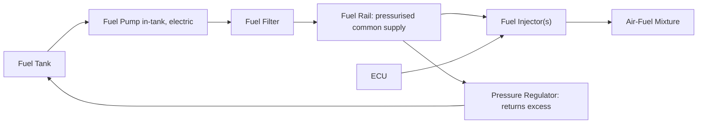
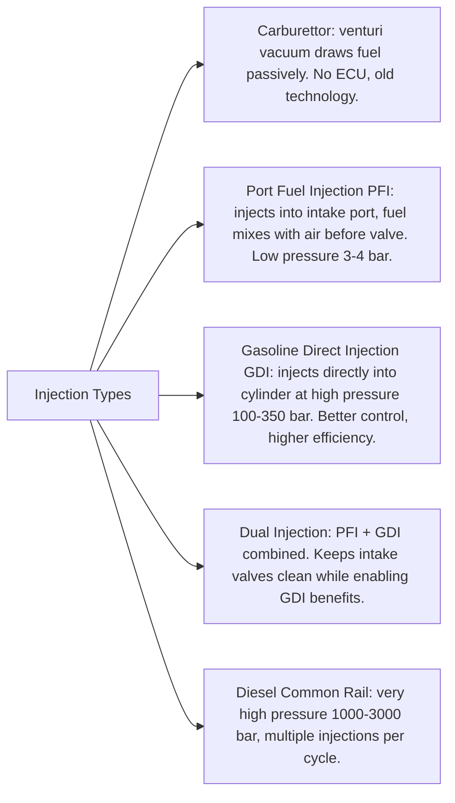

# Fuel System

## What It Is

The fuel system measures, pressurises, and delivers fuel to the intake charge in the
correct quantity and at the correct moment. It controls the air-fuel ratio (AFR),
which determines combustion completeness, efficiency, emissions, and power output.

---

## System Overview



---

## Air-Fuel Ratio (AFR)

AFR is the mass ratio of air to fuel in the charge:

```
  AFR = m_air / m_fuel
```

### Stoichiometric AFR

The stoichiometric (chemically perfect) AFR is the ratio at which all fuel and all
oxygen in the air are consumed simultaneously:

| Fuel | Stoichiometric AFR |
|---|---|
| Gasoline (approx) | 14.7 |
| Diesel | 14.5 |
| Ethanol (E100) | 9.0 |
| E85 (85% ethanol) | ~9.8 |
| Methanol | 6.5 |
| Natural gas (CNG) | 17.2 |
| Hydrogen | 34.3 |

### Lambda (λ) — Normalised AFR

Lambda is the ratio of actual AFR to stoichiometric AFR:

```
  λ = AFR_actual / AFR_stoich

  λ < 1  →  rich mixture (excess fuel, some unburned)
  λ = 1  →  stoichiometric
  λ > 1  →  lean mixture (excess air)
```

Operating rich (λ ~0.85–0.95) produces maximum power — more fuel absorbs heat and
cools the charge, allowing higher fuel mass and reducing knock. Operating lean (λ
~1.05–1.2) improves fuel economy but reduces power and increases NOx at moderate lean.
Very lean (λ > 1.5) causes misfire in conventional gasoline engines.

### Three-Way Catalyst Window

The catalytic converter operates efficiently only within a narrow band around λ = 1
(roughly ±0.01). The ECU's closed-loop fuel control (via the lambda/O2 sensor)
maintains AFR within this window for emissions compliance.

---

## Fuel Properties

| Property | Gasoline | Diesel | Ethanol |
|---|---|---|---|
| Lower Heating Value (LHV) | ~44 MJ/kg | ~42.5 MJ/kg | ~26.8 MJ/kg |
| Research Octane Number (RON) | 91–100 | N/A | 109 |
| Cetane Number | N/A | 45–55 | 5 |
| Density at 15°C | ~740 kg/m³ | ~840 kg/m³ | ~789 kg/m³ |
| Stoichiometric AFR | 14.7 | 14.5 | 9.0 |

**LHV vs HHV:** LHV (Lower Heating Value) excludes the latent heat of the water vapour
in the exhaust. Engines can't recover this heat, so LHV is the correct figure for
efficiency calculations.

---

## Injection Types



### Port Fuel Injection (PFI)
- Fuel injected into the intake port, upstream of the valve
- Low injection pressure (2.5–6 bar)
- Fuel wets the port wall and forms a puddle at cold start — slower transient response
- Good mixture homogeneity by the time the valve opens
- Prone to intake valve carbon deposits (no fuel washing the valve)
- Simpler, cheaper than GDI

### Gasoline Direct Injection (GDI)
- Fuel injected directly into the cylinder, after the intake valve closes
- High pressure (80–350 bar), requires a high-pressure fuel pump
- Precise timing allows **stratified charge** at part load (fuel near spark plug,
  lean elsewhere) → improved part-load efficiency
- Charge cooling: fuel evaporation absorbs heat from the compressed charge → denser
  air, higher knock resistance, allows higher CR
- Carbon deposits on intake valves (no fuel to wash them) — requires periodic cleaning

---

## Injector Sizing

Injector flow rate is measured in cc/min or g/s at a reference pressure.
The required flow rate:

```
  Q_injector ≥ (P_brake / (η_thermal × LHV)) × (1 / ρ_fuel) × safety_factor

  Or, in terms of duty cycle:
  ṁ_fuel = P_brake / (η_brake × LHV)
  Q_per_injector = ṁ_fuel / (N_cylinders × ρ_fuel)
  Duty_cycle = Q_per_injector / (Q_rated × f_injection)
```

Injectors should not exceed ~80–85% duty cycle to allow for transient enrichment.
A typical 86mm bore NA gasoline engine making 80 kW uses roughly 200–300 cc/min injectors.

### Injector Pressure Effect

Injector flow scales with the square root of the pressure differential:

```
  Q_actual = Q_rated × √(ΔP_actual / ΔP_rated)
```

---

## Fuel Delivery Pressure

| System | Pressure |
|---|---|
| Carburettor | 0.2–0.5 bar |
| PFI | 2.5–4.5 bar |
| GDI | 80–350 bar |
| Diesel common rail | 1000–3000 bar |
| E85 PFI (higher flow needed) | 3–5 bar |

---

## Mixture Formation

Before combustion can occur, fuel must be atomised and vaporised into the airstream.

- **Atomisation:** injector breaks fuel into fine droplets (Sauter mean diameter
  ~100–200 µm for PFI, ~15–30 µm for GDI with high pressure)
- **Evaporation:** droplets evaporate in the hot port or cylinder
- **Mixing:** tumble and swirl promote homogeneous charge (see [06-intake-system.md])

Poor mixture formation → uneven combustion → increased HC emissions, reduced efficiency.
Cold start is the hardest case — fuel evaporates poorly, walls are cold, film pools form.

---

## Simulation Notes

For a fuel system simulation you need:

- `afr` — determines fuel mass per cycle from air mass
- `fuel_lhv` — total heat available per kg of fuel burned
- `combustion_efficiency` — fraction of the available heat actually released

```
  m_fuel = m_air / AFR
  Q_total = combustion_efficiency × m_fuel × LHV
```

More detailed models also consider:
- Injection timing (affects mixture homogeneity and charge cooling in GDI)
- Enrichment at full load (λ < 1) and its effect on knock and power
- Cold-start enleanment delay (wall wetting lag in PFI)
- Transient AFR error during throttle transients (accel/decel enrichment)
