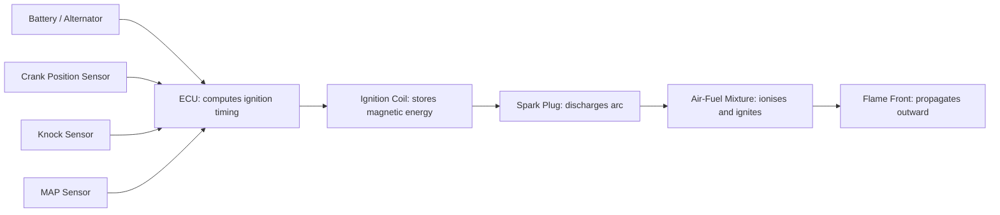
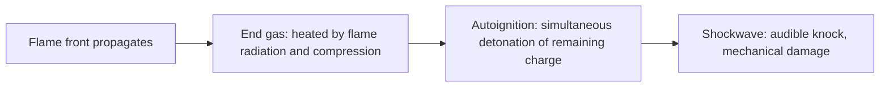
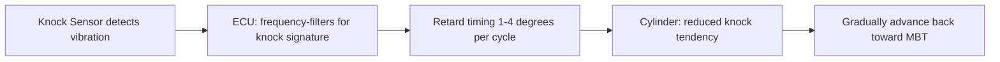

# Ignition System

## What It Is

The ignition system initiates combustion at precisely the right moment in the
compression stroke. In a gasoline (Otto cycle) engine, the compressed air-fuel
mixture is spark-ignited — combustion does not happen spontaneously, it requires
an external trigger. Timing this trigger correctly is critical: too early causes
knock; too late leaves energy on the table.

---

## System Overview



---

## Spark Timing

Spark timing is expressed as **crank degrees Before Top Dead Centre** (BTDC) — the
point at which the spark fires, before the piston reaches TDC on the compression stroke.

Typical spark advance range: 0°–40° BTDC, depending on RPM, load, and fuel.

### Why Advance the Spark?

Combustion is not instantaneous. The flame front takes time (~1–3 ms) to propagate
across the chamber. To get peak cylinder pressure at the optimal crank angle (~10°–15°
ATDC), the spark must fire before TDC:

```
  θ_spark = θ_peak_pressure_target - θ_combustion_duration/2    [degrees BTDC]
```

If the spark fires too late, the piston is already past TDC when peak pressure
occurs — energy is wasted because the volume is increasing rapidly. If too early,
peak pressure occurs before TDC and pushes back against the rising piston.

---

## MBT — Minimum Advance for Best Torque

MBT is the spark advance that maximises torque at a given RPM and load. It is the
point where advancing further reduces torque (piston fights the pressure) and
retarding further also reduces torque (late combustion). It is a saddle point.

```
  MBT typically places peak cylinder pressure at ~15°–20° ATDC
```

Engines run at MBT whenever knock and emissions allow it. The calibration of the
ignition map is largely the process of finding MBT across all operating points.

---

## Ignition Advance vs RPM

Higher RPM means more time passes per crank degree — combustion duration in ms is
roughly constant, so it covers more crank degrees at high RPM:

```
  combustion_degrees = combustion_ms × RPM × 6     [degrees per ms × RPM]

  At 1000 RPM: 1 ms = 6°
  At 6000 RPM: 1 ms = 36°
```

Therefore, advance must increase with RPM to maintain optimal phasing. A typical
advance curve:

| RPM | Spark Advance |
|---|---|
| 800 (idle) | 8°–12° BTDC |
| 2000 | 18°–22° BTDC |
| 4000 | 28°–35° BTDC |
| 6000+ | 30°–40° BTDC |

---

## Ignition Advance vs Load

At high load (wide-open throttle), the cylinder pressure and temperature at the end
of compression are high — closer to the knock threshold. Advance must be reduced
relative to MBT to stay within the knock margin.

At low load (light throttle), charge density is low (manifold vacuum), temperatures
are lower, and the mixture burns more slowly. More advance is needed.

This is why 3D ignition maps (RPM × load → advance) are used in modern ECUs.

---

## Knock (Detonation)

Knock is the spontaneous autoignition of the **end gas** — the unburned portion of
the charge that has not yet been consumed by the advancing flame front. It occurs
when the end gas reaches its autoignition temperature (due to heat and pressure from
the advancing flame and from the compression process itself) before the flame arrives.



### Why Knock is Dangerous

The end-gas detonates all at once, creating a pressure wave (shockwave) that bounces
around the chamber at sonic velocity. This:
- Destroys the oil film on the bore wall and piston crown
- Overloads the piston crown (can punch holes through it)
- Erodes the piston ring lands and head gasket area
- If persistent, causes catastrophic engine failure

### Knock-Limiting Factors

- **Fuel octane number** — higher RON/MON → more resistant to autoignition
- **Compression ratio** — higher CR → higher end-gas temperature → more knock-prone
- **Spark advance** — earlier spark → more time for end-gas to autoignite
- **Charge temperature** — hot charge (e.g. high intake air temp) → more knock
- **AFR** — slightly rich (λ ~0.9) absorbs heat, reduces knock
- **Chamber design** — short flame travel distance, good squish

### Octane Number

The octane number rates a fuel's knock resistance:
- **RON** (Research Octane Number) — test at low speed/light load
- **MON** (Motor Octane Number) — test at higher speed/higher load
- **AKI** = (RON + MON) / 2 — "pump octane" used in the USA
- European pumps label RON directly

Each additional point of CR requires roughly +2–3 RON to maintain the same knock margin.

---

## Knock Control

Modern engines run close to the knock boundary for maximum efficiency. A knock sensor
(piezoelectric accelerometer on the block) detects knock vibration:



Knock retard is cylinder-selective in modern engines — only the knocking cylinder
is retarded. Recovery is slow (0.5–1°/cycle) to avoid re-entering knock immediately.

---

## The Spark Plug

The spark plug provides the electrode gap across which the ignition coil discharges.

```
  Spark gap:   0.5–1.2 mm (typical)
  Breakdown voltage:  10–30 kV
  Spark duration:     ~1–3 ms (inductive discharge)
  Spark energy:       30–100 mJ
```

### Heat Range

The spark plug's heat range determines how quickly the insulator nose dissipates heat.
A cold plug runs cooler — required in high-output engines to avoid pre-ignition (the
plug tip glowing hot enough to ignite the charge before the spark fires). A hot plug
self-cleans at lower temperatures — used in low-load engines to burn off carbon deposits.

---

## Pre-ignition vs Detonation (Knock)

These are often confused:

| | Pre-ignition | Detonation / Knock |
|---|---|---|
| Cause | Hot spot ignites mixture before spark | End-gas autoignites after spark |
| Timing | Before spark fires | After spark fires |
| Trigger | Glowing plug, deposit, valve edge | Pressure + temperature, slow flame |
| Control | Cold plug, clean chamber | Octane, advance retard, AFR |
| Severity | Often more damaging | Audible click; can be managed |

---

## Simulation Notes

For an ignition system simulation you need:

- `spark_advance` — the trigger crank angle (degrees BTDC → converted to absolute)
- The combustion model starts at this angle (see [09-thermodynamics.md](09-thermodynamics.md))
- `combustion_duration` — how many degrees the burn takes; sets the Wiebe window
- Knock detection: requires tracking end-gas temperature and comparing to an
  autoignition threshold function of pressure and temperature (Arrhenius-type model)
- Knock retard: a feedback loop that reduces spark advance when knock is detected

A basic simulation models combustion as starting at `spark_advance` BTDC and
completing over `combustion_duration` degrees using the Wiebe function — no explicit
flame propagation needed.
