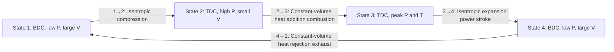

# Thermodynamics

## What It Is

Engine thermodynamics governs how the energy stored in fuel is converted into
mechanical work inside the cylinder. The working fluid (air, fuel vapour, and combustion
products) undergoes a sequence of thermodynamic processes — compression, heat addition,
expansion, and heat rejection — that together constitute the engine cycle.

Understanding thermodynamics is the core of understanding why engines work and what
their fundamental efficiency limits are.

---

## The Ideal Otto Cycle

The Otto cycle is the theoretical ideal for a spark-ignition (gasoline) engine. It
consists of four reversible processes:



### Ideal Thermal Efficiency

```
  η_Otto = 1 - 1 / CR^(γ-1)

  γ = ratio of specific heats (Cp/Cv)
```

For air, γ ≈ 1.4:
- CR = 8   → η = 56.5%
- CR = 10  → η = 60.2%
- CR = 12  → η = 62.9%
- CR = 14  → η = 64.9% (diesel territory)

This is the maximum possible thermal efficiency for the cycle. Real engines achieve
50–65% of this ideal.

---

## The Ideal Gas Law

The cylinder gas is modelled as an ideal gas:

```
  P × V = m × R × T

  where:
    P = pressure [Pa]
    V = volume [m³]
    m = mass of gas [kg]
    R = specific gas constant [J/(kg·K)]
    T = temperature [K]

  R_air = 287 J/(kg·K)
```

The ideal gas law lets us compute any one of P, V, T if we know the other two and the
mass. This is the fundamental equation of state used at every step of the simulation.

---

## Ratio of Specific Heats (γ)

γ = Cp / Cv determines how much the gas heats up when compressed and how much pressure
rises per unit of volume change.

For air (diatomic gas):
```
  γ = 1.4    at room temperature (300 K)
  γ ≈ 1.32   at 1000 K
  γ ≈ 1.28   at 2000 K (burned gas)
```

γ decreases with temperature because higher-energy modes of molecular vibration become
active. For combustion products (burned gas), γ ≈ 1.25–1.28 is a better estimate than 1.4.

Using a constant γ = 1.35 is a common practical compromise for in-cylinder simulation.
More accurate models interpolate γ as a function of temperature (JANAF tables).

---

## Isentropic Processes

An isentropic process is adiabatic (no heat transfer) and reversible. Compression and
expansion strokes are approximately isentropic during the brief window before combustion:

```
  P1 × V1^γ = P2 × V2^γ    →    P2 = P1 × (V1/V2)^γ

  T2 = T1 × (V1/V2)^(γ-1)
```

### Compression Ratio and Peak Pressure

At the end of the compression stroke (TDC), before combustion:
```
  P_TDC = P_BDC × CR^γ

  At P_BDC = 101325 Pa, CR = 10, γ = 1.35:
  P_TDC ≈ 101325 × 10^1.35 ≈ 2.24 MPa (22.1 bar)

  T_TDC = T_BDC × CR^(γ-1)
  At T_BDC = 320 K:
  T_TDC ≈ 320 × 10^0.35 ≈ 716 K  (443°C)
```

This temperature is below the autoignition point for gasoline (~250–450°C in practice
with pressure dependence) — which is why gasoline needs a spark.

---

## Heat Release and Combustion

### Total Heat Available

```
  Q_total = η_combustion × (m_air / AFR) × LHV

  where:
    η_combustion = combustion efficiency (0.80–0.95)
    m_air        = mass of air trapped in cylinder [kg]
    AFR          = air-fuel ratio (14.7 for stoichiometric gasoline)
    LHV          = lower heating value of fuel [J/kg]
                   (gasoline ≈ 44,000,000 J/kg)
```

### The Wiebe Function — Heat Release Rate

Combustion is not instantaneous. The Wiebe function models the cumulative fraction of
fuel burned (burn fraction) as a function of crank angle:

```
  x_b(θ) = 1 - exp[-a × ((θ - θ_0) / Δθ)^(m+1)]

  where:
    θ_0  = start of combustion (crank angle where spark fires)
    Δθ   = combustion duration [degrees]
    a    = shape parameter (typically 5.0)
    m    = shape parameter (typically 2.0)
```

The differential heat release rate:
```
  dQ/dθ = Q_total × (dx_b/dθ)
```

The Wiebe function produces an S-shaped burn curve:
- Slow start (initial flame kernel growth)
- Rapid middle (established flame front)
- Slow tail (burnout of residuals near walls)

### Wiebe Parameters

| Parameter | Effect | Typical value |
|---|---|---|
| a = 5.0 | Controls how much fuel is unburned at Δθ (~1% at a=5) | 5.0 |
| m = 2.0 | Shape of the S-curve; higher m → later, faster main burn | 1.5–3.0 |
| Δθ | Duration in crank degrees | 30°–90° |

Higher RPM: same combustion in ms → more crank degrees → Δθ increases with RPM.

---

## First Law Applied to the Cylinder

The first law of thermodynamics for an open/closed system:

```
  dU = δQ - δW + h_in × dm_in - h_out × dm_out

  where:
    dU   = change in internal energy of gas = m × Cv × dT
    δQ   = heat added (combustion) minus heat lost to walls
    δW   = work done by gas = P × dV
    h    = specific enthalpy of incoming/outgoing gas
    dm   = mass flow through valves
```

During the closed phase (compression and power strokes, valves shut):
```
  dU = δQ_combustion - δQ_wall_loss - P × dV

  m × Cv × dT = δQ_combustion - δQ_wall_loss - P × dV
```

This is the differential equation solved at each simulation step. Rearranging for dT:
```
  dT = (δQ_combustion - δQ_wall_loss - P × dV) / (m × Cv)
```

Then pressure follows from the ideal gas law:
```
  P = m × R × T / V
```

---

## The P-V Diagram

The pressure-volume diagram traces the thermodynamic state of the cylinder through
the cycle. Area enclosed = work output per cycle.

```
  Indicated Work = ∮ P dV    [J per cycle]

  IMEP = W_indicated / Vd    [Pa]
```

Key features of the P-V diagram:
- Near-vertical compression line (isentropic compression from BDC to TDC)
- Pressure spike at TDC (combustion — rapid pressure rise at roughly constant volume)
- Steep expansion line (isentropic expansion from TDC to BDC)
- Sharp pressure drop at EVO (exhaust valve opens — blowdown)

The difference between the high-pressure power curve and the low-pressure pumping loop
(intake/exhaust) is the net indicated work.

---

## Pumping Losses

During the gas exchange strokes (intake and exhaust), the piston does work against
(or receives work from) the manifold pressures. At wide-open throttle, these are small.
At part throttle, intake manifold vacuum creates a significant pumping loss:

```
  W_pumping ≈ (P_exhaust - P_intake) × Vd

  At idle: P_intake ≈ 40 kPa, P_exhaust ≈ 105 kPa
  W_pumping ≈ (105,000 - 40,000) × 0.0005 ≈ 32 J per cycle
```

This is why throttled gasoline engines have much higher part-load fuel consumption
than unthrottled diesels.

---

## Temperature Limits

| Location | Temperature | Significance |
|---|---|---|
| Peak combustion gas | 2000–2800 K | Dissociation of N₂ → NOx formation |
| Average gas at power TDC | 1500–2200 K | Material limits for pistons/valves |
| Exhaust gas at EVO | 700–1100 K | Exhaust system materials, turbo entry |
| Piston crown surface | 300–450°C | Aluminium softening ~250°C |
| Cylinder wall (coolant side) | 90–110°C | Optimal coolant temperature |

---

## Simulation Notes

To simulate the cylinder thermodynamics you need at each crank angle step dθ:

1. Compute V(θ) from kinematics
2. If valves open: compute mass flow in/out, update gas mass m
3. Compute dQ_combustion = Q_total × Δx_b(θ) from Wiebe
4. Compute dQ_wall_loss from heat transfer model (see [11-heat-transfer.md](11-heat-transfer.md))
5. Compute dW = P × dV (work done by piston motion)
6. Update temperature: dT = (dQ_combustion - dQ_wall_loss - dW) / (m × Cv)
7. Update pressure from ideal gas: P = m × R × T / V
8. Compute torque: τ = F_gas × r × sin(θ + β) / cos(β)

Key parameters: `compression_ratio`, `afr`, `fuel_lhv`, `combustion_efficiency`,
`wiebe_a`, `wiebe_m`, `combustion_duration`, `spark_advance`, `ambient_pressure`,
`ambient_temperature`
