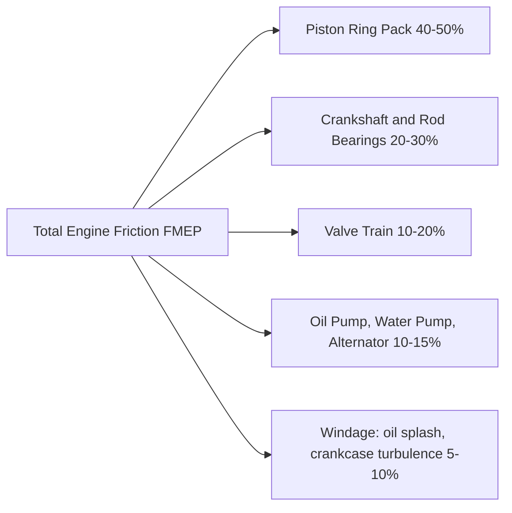
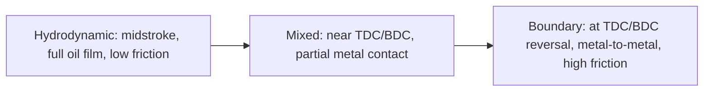

# Friction Losses

## What They Are

Friction losses are the mechanical energy consumed internally by the engine that never
reaches the output shaft. They represent the gap between indicated power (what the
combustion gas delivers to the piston) and brake power (what the crankshaft actually
delivers). Minimising friction is one of the primary goals of engine development.

---

## Sources of Friction



Piston ring friction is the dominant contributor — this is why low-friction ring
packages are one of the biggest gains in modern engine development.

---

## Friction Mean Effective Pressure (FMEP)

FMEP is the normalised friction force, expressed as an equivalent pressure that
would produce the same work loss over one cycle:

```
  FMEP = W_friction / Vd    [Pa]

  W_friction = IMEP - BMEP    [Pa]

  IMEP = indicated work / Vd    (from P-V diagram)
  BMEP = 2π × τ_brake × n_strokes / Vd    (from dynamometer)
```

Typical FMEP values (naturally aspirated gasoline):
- Cold engine (~20°C): 150–300 kPa
- Warm engine (~90°C): 80–150 kPa
- Full-load peak: 50–100 kPa (lower because pumping losses decrease at WOT)

---

## Piston Ring Friction

Ring friction is the largest component. Each ring presses against the bore wall
with a radial contact force:

### Ring Pack Contact Force

```
  F_ring_radial = tangential_ring_tension × 2    (simplified Lamé approximation)
```

The friction force is then:
```
  F_ring_friction = μ_ring × F_ring_normal    (for boundary/mixed lubrication)

  In full hydrodynamic lubrication:
  F_ring_friction = η × v_piston × A_ring / h_oil_film

  where:
    η = dynamic viscosity of oil [Pa·s]
    v_piston = instantaneous piston velocity [m/s]
    h_oil_film = oil film thickness [m] (~1–5 µm)
```

### Lubrication Regimes of the Ring-Bore Interface

The ring-bore interface passes through different lubrication regimes as the piston
decelerates and reverses near TDC and BDC:



The Stribeck curve describes this transition:

```
  Stribeck number = η × v / F_normal

  Low Stribeck (slow, low viscosity, high load) → boundary lubrication
  High Stribeck (fast, high viscosity, low load) → hydrodynamic lubrication
```

Near TDC and BDC, the piston velocity is zero and the oil film collapses — this is
where most ring friction occurs. This is also why ring friction is so sensitive to
combustion chamber temperature (hot oil = lower viscosity = thinner film near TDC).

### Ring Friction by Ring

| Ring | Friction contribution | Reason |
|---|---|---|
| Top compression ring | Highest | Exposed to full cylinder pressure at TDC; boundary lubrication |
| Second ring | Medium | Moderate pressure, some hydrodynamic regime |
| Oil control ring | Lowest | High contact area but at low pressure, mid-stroke mostly |

---

## Crankshaft Bearing Friction

Main bearings and con rod big-end bearings operate in hydrodynamic lubrication.
Journal bearing friction follows the Petroff equation (fully hydrodynamic):

```
  τ_bearing = η × ω × π × r³ × L / c

  where:
    η = oil dynamic viscosity [Pa·s]
    ω = angular velocity of journal [rad/s]
    r = journal radius [m]
    L = bearing width [m]
    c = radial clearance [m] (~0.02–0.05 mm)
```

Bearing friction scales with RPM and oil viscosity. This is why modern engines use
low-viscosity oils (0W-20, 0W-16) — thinner oil reduces bearing drag at operating
temperature while maintaining sufficient film at startup.

---

## Valve Train Friction

Valve train friction depends on the type:

- **Flat tappet (sliding):** high friction at cam-follower interface, Hertz contact
  pressure, boundary lubrication at cam nose
- **Roller tappet:** rolling contact replaces sliding — much lower friction
  (~50% reduction vs flat tappet in some tests)
- **Finger follower with roller:** modern DOHC standard, very low friction

```
  F_camshaft_torque ≈ Σ(F_spring × μ_follower × L_moment_arm)
```

Valve spring pre-load is the dominant force. Higher spring loads (required at high RPM
to prevent float) linearly increase valve train friction.

---

## Pumping (Accessory) Friction

### Oil Pump
Usually a gear pump driven from the crankshaft. Power consumed:
```
  P_oil_pump = ΔP_oil × Q_oil / η_pump

  ΔP_oil ≈ 2–5 bar (engine oil pressure)
  Q_oil ≈ 10–30 L/min
  η_pump ≈ 0.6–0.8
```
Variable displacement oil pumps reduce this loss at low load by adjusting flow.

### Water Pump
Centrifugal pump, low-pressure. Power consumed ≈ 0.5–2 kW at full speed.

### Alternator
Converts mechanical energy to electricity. Efficiency ~65–80%.
Typical load: 500–1500 W electrical = 700–2000 W mechanical.

---

## Windage

As the crankshaft spins, it churns the oil mist and air in the crankcase. Crankshaft
counterweights and rotating con rod assemblies create significant turbulence at high RPM:

```
  P_windage ∝ ρ_crankcase × ω³    (strong RPM dependence)
```

Windage trays below the crankshaft reduce windage by preventing aerated oil from
re-entering the rotating assembly. Dry sump systems eliminate crankcase oil almost
entirely, virtually eliminating windage losses — hence their use in racing engines.

---

## Temperature Dependence

Friction decreases significantly as the engine warms up because oil viscosity drops:

```
  η(T) ≈ A × exp(B / T)    (Walther equation, approximately)
```

A cold engine at 20°C may have 3× the friction of a fully warmed engine at 90°C.
This is why fuel consumption and emissions are worst during cold starts.

---

## Friction vs RPM

Different friction sources scale differently with RPM:

| Source | RPM dependence | Dominant at |
|---|---|---|
| Ring friction (boundary, TDC/BDC) | Roughly constant | All RPMs |
| Ring friction (hydrodynamic, midstroke) | ∝ RPM | High RPM |
| Bearing friction (hydrodynamic) | ∝ RPM | High RPM |
| Valve train | ∝ RPM² (sliding followers) | High RPM |
| Windage | ∝ RPM³ | Very high RPM |
| Pumping losses (at part throttle) | Load-dependent | Part throttle |

This is why high-RPM engines need more careful friction engineering — windage and
bearing losses can become the dominant power consumers.

---

## Simulation Notes

For a friction simulation you need:

- `ring_friction_coefficient` µ — Coulomb model: F_ring = µ × F_normal
- `viscous_friction` — coefficient for RPM-dependent (hydrodynamic) component
- Total friction force per step: F_friction = F_coulomb + F_viscous × v_piston
- Friction torque: same torque-from-force conversion as gas force (via crank geometry)
- Or expressed as FMEP: directly subtract from IMEP

Simple two-term model:
```
  FMEP = A + B × (ω / ω_ref)    [Pa]
```

More accurate: compute friction force at each crank angle and integrate:
```
  F_friction(θ) = μ_ring × F_ring_normal + C_viscous × |v_piston(θ)|
```

Wall temperature affects oil viscosity, which affects viscous friction — coupling
friction to the thermal model improves accuracy.
