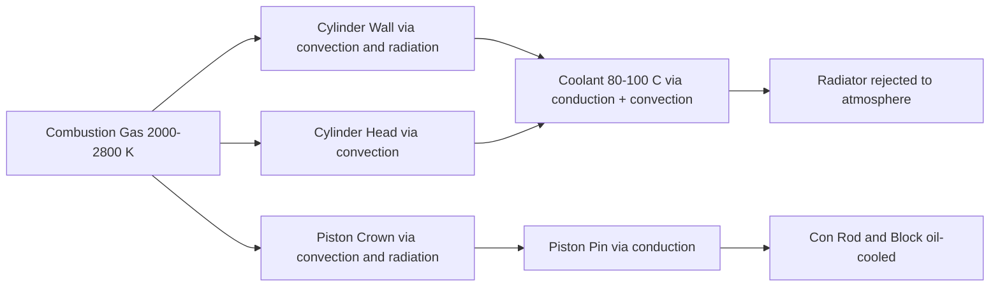

# Heat Transfer

## What It Is

Heat transfer describes how thermal energy moves between the hot combustion gases
and the surrounding structure (cylinder walls, piston crown, cylinder head). Heat
transfer has two major effects on the engine:

1. **Reduces indicated efficiency** — heat that goes into the walls doesn't do work
2. **Limits material temperatures** — the piston, valves, and cylinder head have
   strict temperature limits

Managing heat transfer is central to both performance and reliability.

---

## Heat Flow Paths



Approximately 25–35% of the fuel's energy leaves as heat through the coolant.
Another 30–40% leaves via the exhaust gas.

---

## In-Cylinder Convection: The Woschni Correlation

The dominant heat transfer mode during combustion and expansion is forced convection.
The Woschni correlation (1967) is the industry standard for estimating the heat
transfer coefficient inside the cylinder:

```
  h = C₁ × B^(-0.2) × P^0.8 × T^(-0.55) × w^0.8

  where:
    h  = heat transfer coefficient [W/(m²·K)]
    B  = cylinder bore [m]
    P  = cylinder pressure [Pa]
    T  = gas temperature [K]
    w  = characteristic gas velocity [m/s]
    C₁ = empirical constant (~3.26)
```

### Characteristic Gas Velocity w

```
  w = C₂ × v_mean_piston + C₃ × (Vd × T₁)/(P₁ × V₁) × (P - P_motored)

  where:
    C₂ ≈ 2.28 (gas exchange) or 6.18 (compression/expansion)
    C₃ ≈ 0.0 (gas exchange, compression) or 3.24×10⁻³ (combustion, expansion)
    P_motored = pressure that would exist without combustion (from isentropic law)
    P₁, V₁, T₁ = state at intake valve closing (reference condition)
```

The second term in w accounts for the additional turbulence created by combustion.

### Heat Flux

```
  Q̇_wall = h × A_combustion_chamber × (T_gas - T_wall)    [W]

  A = combustion surface area ≈ A_piston + A_head + π × B × x(θ)
```

The surface area changes with crank angle as the piston moves.

---

## Radiation

At peak combustion temperatures (>2000 K), radiation from soot particles (in diesel)
and flame luminosity contributes. In spark-ignition engines radiation is typically
10–20% of total in-cylinder heat transfer:

```
  Q̇_radiation = ε × σ × A × (T_gas⁴ - T_wall⁴)

  ε ≈ 0.7–0.9 for combustion gases
  σ = 5.67×10⁻⁸ W/(m²·K⁴)    (Stefan-Boltzmann constant)
```

Radiation is often included as a correction to the Woschni coefficient rather than
computed separately.

---

## Wall Thermal Model

The cylinder wall acts as a thermal mass:

```
  m_wall × Cp_wall × dT_wall/dt = Q̇_gas→wall - Q̇_wall→coolant

  Q̇_gas→wall     = h_gas × A × (T_gas - T_wall)
  Q̇_wall→coolant = h_coolant × A × (T_wall - T_coolant)
```

### Simplified Lumped Model

If the wall temperature is assumed to change slowly (thermal time constant >>
combustion cycle duration), T_wall can be treated as a slowly-evolving variable
updated over many cycles:

```
  C_wall × dT_wall/dt = Q̇_gas→wall_avg - Q̇_wall→coolant

  C_wall = ρ_wall × Cp_wall × V_wall    [J/K]

  For cast iron (ρ = 7200 kg/m³, Cp = 500 J/kg·K), a 5mm thick wall:
  C_wall ≈ 7200 × 500 × π × B × S × 0.005 ≈ ~500–1500 J/K
```

At steady state, T_wall settles to a value between T_gas_avg and T_coolant.

---

## Piston Thermal Load

The piston crown is the hottest engine component in normal operation. Heat flows:

```
  From combustion gas → piston crown (convection)
  → piston body (conduction, radially outward)
  → piston rings and ring lands (to bore oil film)
  → piston pin boss → pin → con rod small end (to oil)
  → bottom of piston skirt (via oil gallery in some designs)
```

Piston crown temperature limits:
- Aluminium alloy pistons: maximum crown surface ~350–400°C (softening limit)
- Oil-cooled pistons (piston oil jets): actively cooled underside ~250–300°C max
- Ring groove area: must stay below ~200°C to avoid oil coking and ring sticking

---

## Exhaust Valve Thermal Load

The exhaust valve is exposed to hot combustion products throughout the exhaust stroke.
It is one of the most thermally stressed components.

Heat path:
```
  Gas → valve face → valve head → valve stem → valve guide → cylinder head → coolant
```

Sodium-filled hollow exhaust valves are used in high-performance engines — the sodium
melts at operating temperature and sloshes back and forth, transferring heat from the
head to the stem far more effectively than solid metal.

Exhaust valve head temperatures: 600–900°C (titanium or nickel alloy required above ~750°C).

---

## Coolant Side

The coolant side of the wall is a forced convection boundary:

```
  h_coolant ≈ 2000–8000 W/(m²·K)    (turbulent water-glycol flow)
```

This is much higher than the gas-side coefficient during intake/exhaust strokes,
but the gas-side coefficient during combustion can be comparable or exceed it momentarily.

### Wilson's Law (Thermal Resistance)

```
  T_gas → T_coolant:

  Q̇ = (T_gas - T_coolant) / (1/h_gas + t_wall/k_wall + 1/h_coolant)

  where:
    t_wall   = wall thickness [m]
    k_wall   = thermal conductivity [W/(m·K)]
               cast iron: ~50 W/(m·K)
               aluminium: ~160 W/(m·K)
```

Aluminium has much better conductivity than cast iron — this is why modern cylinder
heads and increasingly blocks use aluminium alloys.

---

## Heat Transfer and Knock

Higher wall temperatures → higher end-gas temperature → lower knock threshold.
This is one reason engines run hot (90°C coolant) rather than cold — the efficiency
gain from faster vaporisation and lower viscosity outweighs the slight knock risk.
Heavily boosted engines may run cooler coolant (80°C) to protect against knock.

---

## Heat Rejection Budget (Typical NA Gasoline)

```
  Fuel energy input: 100%
  Exhaust gas:       30–40%
  Coolant:           25–35%
  Oil:               3–8%
  Radiation/other:   2–5%
  Brake power:       25–38%
```

---

## Simulation Notes

For a heat transfer simulation you need:

- `wall_conductivity` — thermal conductivity of the wall material [W/(m·K)]
- `coolant_temperature` — fixed boundary condition [K]
- Wall temperature: a state variable updated from the lumped model above
- Per-step heat loss: Q_wall_loss = h_gas × A(θ) × (T_gas - T_wall) × dt
- Simple model: use a constant h_gas ≈ 500–1000 W/(m²·K) during combustion/expansion,
  ~100–200 W/(m²·K) during intake/exhaust (lower velocity, lower pressure)
- More accurate: implement the Woschni correlation with temperature-dependent coefficients

The wall temperature has three effects:
1. Direct heat loss reduces expansion work → lower indicated efficiency
2. Higher wall temperature warms incoming charge → lower density → lower mass intake
3. Higher wall temperature raises end-gas temperature → knock risk
