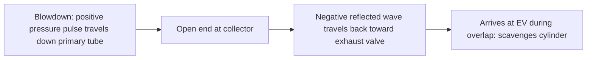
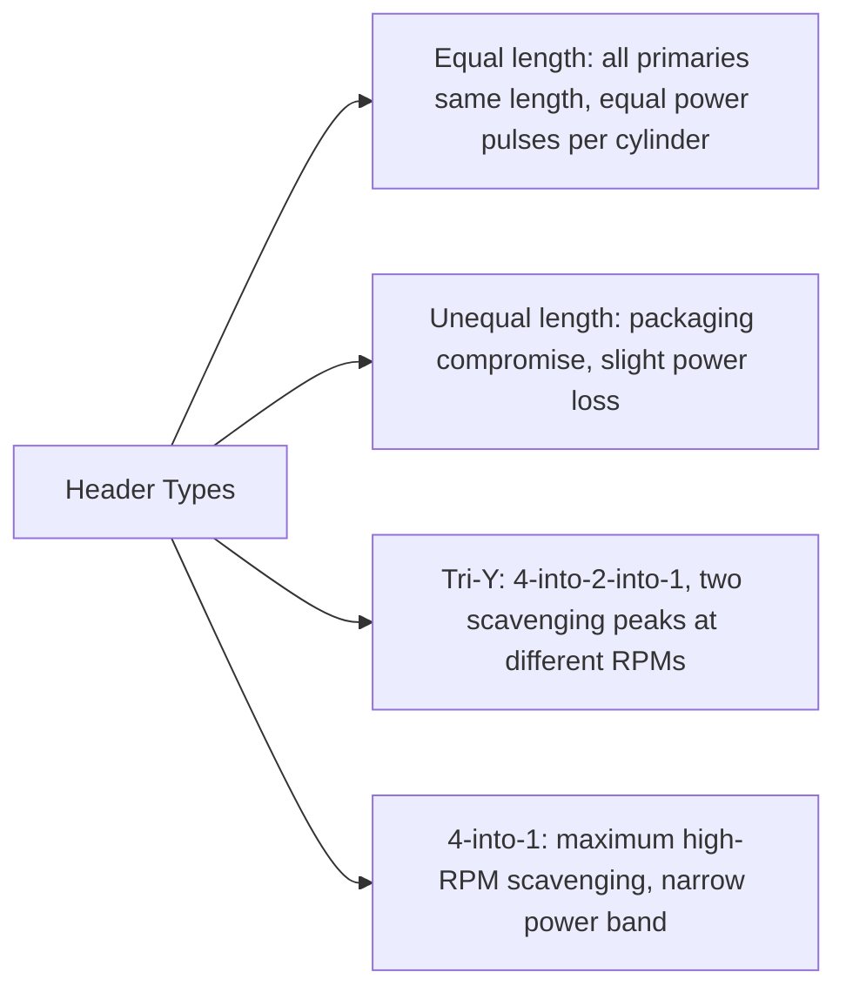
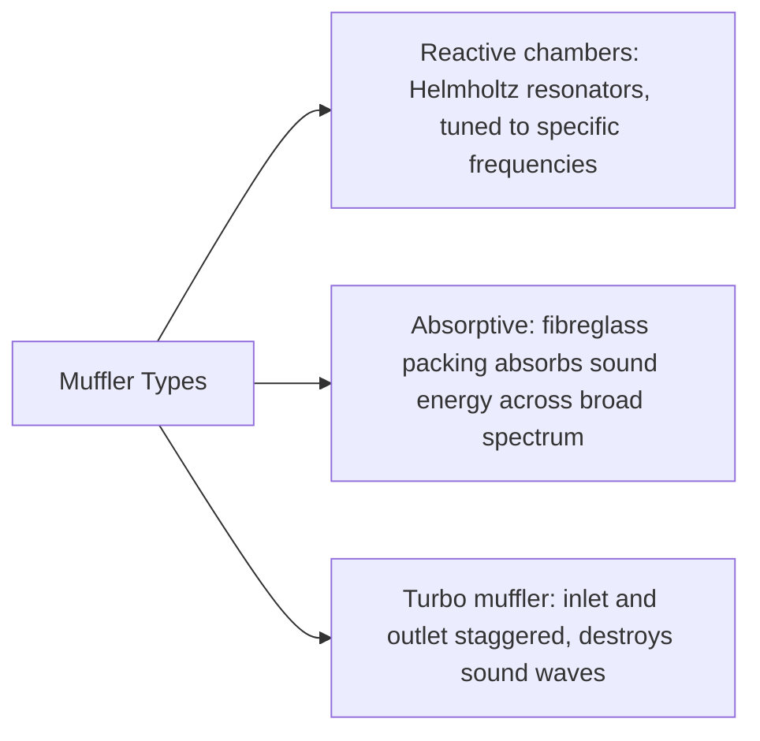

# Exhaust System

## What It Is

The exhaust system removes spent combustion gases from the cylinder, recovers some
energy through tuned pressure pulses, and reduces noise and harmful emissions before
releasing gases to the atmosphere. Exhaust design profoundly affects power output —
back-pressure robs power, but correctly tuned exhaust pulses can scavenge the cylinder
and help fill it with fresh charge.

---

## System Overview


---

## The Blowdown Event

When the exhaust valve opens (EVO, typically 40–60° before BDC), the cylinder
pressure is still significantly above exhaust manifold pressure. This pressure
differential drives a high-velocity blowdown pulse:

```
  Pressure ratio at EVO ≈ P_cylinder(EVO) / P_exhaust

  Typical: 3–8 bar cylinder / 1.05 bar exhaust ≈ 3:1 to 8:1
```

If the pressure ratio exceeds the critical value (≈ 1.89 for γ = 1.35), the flow
at the exhaust valve is **choked** — gas exits at sonic velocity. The blowdown
pulse carries:
- High-temperature gas (600–1000°C at EVO)
- High-velocity flow that creates a strong pressure wave in the primary pipe
- Significant acoustic energy (one of the main noise sources)

---

## Exhaust Gas Temperature

Exhaust gas temperature (EGT) at the exhaust valve:

```
  T_EGT ≈ T_gas(EVO)    [K]

  Typical values:
  Idle (low load):     400–600°C
  Full load NA:        700–900°C
  Turbocharged WOT:    900–1050°C
  Lean misfire:        very high (unburned charge combusts in manifold)
```

EGT is one of the most important monitoring parameters for engine health.

---

## Exhaust Pressure Waves

The blowdown pulse propagates as a positive pressure wave down the primary tube
at the speed of sound. When it reaches an area change (collector, junction, pipe end):
- **Open end (atmosphere):** reflects as a **negative** (rarefaction) wave
- **Closed end (solid wall):** reflects as a **positive** pressure wave
- **Area expansion:** partial positive reflection, partial transmission



If the tuned negative wave arrives at the exhaust valve just before it closes
(and while the intake valve is open — overlap period), it actively scavenges
residual gas from the cylinder and helps draw in fresh charge.

### Optimal Primary Pipe Length

The wave must travel to the open end and back in the time between EVO and the end
of overlap:

```
  L_primary ≈ v_sound × t_window / 2

  t_window ≈ (EVO_angle_to_overlap_end) / (ω × 180/π)

  Simplified:
  L_primary ≈ (v_sound × 60 × K) / (RPM × N_cylinders)

  where K ≈ 0.5–0.75 (empirical, depends on overlap)
  v_sound ≈ 550 m/s in hot exhaust gas
```

Typical primary lengths:
- Tuned for 5000–7000 RPM (sport): ~400–600 mm
- Tuned for 3000–4500 RPM (torque): ~700–900 mm

---

## Header Design

The exhaust header is the performance-critical part of the system. A good header
extracts maximum energy from pressure waves.



**4-into-1 headers** (all 4 primaries merge into a single collector) give maximum
scavenging because each cylinder can benefit from the negative pulse of the preceding
cylinder's blowdown. Works best with the right firing order spacing (180° for an I4).

**Tri-Y** (4-into-2-into-1) broadens the power band by creating two resonance peaks.

---

## Back Pressure

Back pressure is the exhaust pressure measured at the exhaust valve (above atmospheric).
It has two effects:

1. **Harder to expel residuals** — the piston works against higher pressure during the
   exhaust stroke → more pumping loss
2. **More residuals remain in cylinder** — displaces fresh charge → lower ηv

Sources of back pressure:
- Catalytic converter: ~5–20 kPa at full load (much less with modern substrates)
- Muffler: ~5–30 kPa depending on design
- Pipe bends and restrictions

High-performance exhaust systems minimise back pressure with:
- Larger diameter pipes
- Smooth, gradual bends (mandrel bends, not crush bends)
- Less restrictive muffler design

---

## Valve Overlap and Scavenging

During the overlap period (both intake and exhaust valves open near TDC of the
exhaust stroke), the exhaust system and intake system interact:

```
  At high RPM:
    - Intake charge velocity is high → gas flows through into exhaust (charge loss) if poorly timed
    - But a negative exhaust pulse creates strong scavenging suction → net benefit

  At low RPM (idle):
    - Low velocity → no beneficial ram effect
    - Exhaust residuals flow back into intake port during overlap → poor idle quality
    - Large overlap camshafts idle poorly
```

The scavenging effect is why performance camshafts with large overlap make power
at high RPM but run rough at idle.

---

## Catalytic Converter

The three-way catalytic converter (TWC) oxidises HC and CO, and reduces NOx:

```
  HC + O₂  →  CO₂ + H₂O    (oxidation)
  CO + O₂  →  CO₂           (oxidation)
  NOx + HC →  N₂ + CO₂ + H₂O   (reduction)
```

Requires:
- Operating temperature: >250°C (light-off temperature) — 200–400°C for modern catalysts
- Lambda ≈ 1.00 (±0.01) — all three reactions work simultaneously only at stoichiometry
- Precious metal coating: platinum, palladium, rhodium

The catalytic converter is a significant restriction in cold conditions (before
light-off), which is why some vehicles position it very close to the exhaust manifold
(close-coupled cat) to reach operating temperature quickly.

---

## Muffler (Silencer)

Noise attenuation without excessive back pressure — an inherent trade-off.



Performance mufflers use absorptive packing in a straight-through design (low
back pressure, loud), while OEM mufflers use complex reactive chamber geometry
(more back pressure, very quiet).

---

## Exhaust Gas Recirculation (EGR)

EGR routes a portion of the exhaust gas back into the intake manifold. Hot inert gas
dilutes the fresh charge:
- Reduces peak combustion temperature → lower NOx
- Lowers pumping losses (throttle can open more for same load)
- Allows more aggressive ignition advance at part load

```
  EGR rate = V_egr / (V_fresh + V_egr)    [fraction, typically 5–25%]
```

High EGR rates can cause misfire and instability — the limit is when combustion
quality degrades unacceptably.

---

## Simulation Notes

For an exhaust system simulation you need:

- `evo` — EVO angle determines blowdown timing
- Blowdown pulse intensity: proportional to pressure ratio P_cyl(EVO) / P_exhaust
- Exhaust gas temperature at EVO: T_exhaust ≈ T_gas at the moment EVO occurs
- Back pressure: can be a constant or computed from a pipe flow model
- Pressure wave model: requires 1D gas dynamics (Method of Characteristics or
  Finite Volume for the exhaust pipe) — this is where significant simulation
  complexity lies
- Simple model: treat exhaust manifold as a constant-pressure reservoir at ~P_ambient
  and compute cylinder emptying via orifice flow through the exhaust valve

For audio synthesis: the blowdown pulse is the primary source of exhaust noise —
its timing (once per firing event) is the fundamental frequency; harmonics create
the exhaust note character.
