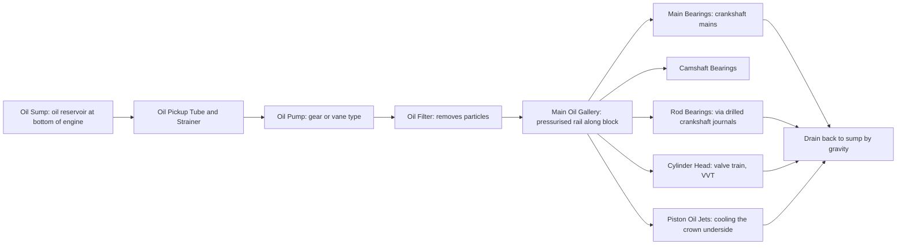

# Lubrication System

## What It Is

The lubrication system circulates oil throughout the engine to:
1. Separate moving metal surfaces with a hydrodynamic film (reducing friction and wear)
2. Remove heat from components that can't be directly water-cooled (pistons, bearings)
3. Clean internal surfaces by suspending particles and delivering them to the filter
4. Protect against corrosion

Without lubrication, metal-to-metal contact between bearings and journals would
cause catastrophic failure within seconds at operating speed.

---

## System Overview



---

## Engine Oil

Oil is a complex fluid with multiple functions. Its most critical property is viscosity.

### Viscosity

Dynamic viscosity η [Pa·s] is the oil's resistance to shear. It determines:
- Bearing film thickness (thicker film = better protection, more drag)
- Pumping power required (higher η = more pump work)
- Startup protection (must flow at low temperature)

Oil viscosity drops dramatically with temperature:

```
  At 20°C:  η ≈ 100–300 mPa·s  (thick, high protection, hard to pump)
  At 90°C:  η ≈ 10–20 mPa·s   (operating condition)
  At 120°C: η ≈ 5–10 mPa·s    (high-load condition)
```

### SAE Viscosity Grades

The SAE J300 standard defines viscosity grades:

| Grade | Cold viscosity limit | Hot viscosity (100°C) |
|---|---|---|
| 0W | Flows at -35°C | ≥ 5.6 cSt |
| 5W | Flows at -30°C | ≥ 5.6 cSt |
| 20 | — | 6.9–9.3 cSt |
| 30 | — | 9.3–12.5 cSt |
| 40 | — | 12.5–16.3 cSt |

A multigrade oil (e.g. 5W-30) has a thin "W" (winter) viscosity at cold temperature
and behaves like a "30" grade when hot. Achieved using viscosity index improvers —
polymer additives that expand at high temperature to reduce thinning.

Modern low-friction engines use 0W-20 or 0W-16 oil. Older engines designed for
10W-40 or 20W-50 require thicker oil to maintain minimum film thickness.

---

## Hydrodynamic Journal Bearings

The crankshaft main bearings and con rod big-end bearings operate as hydrodynamic
journal bearings. This is the most efficient bearing type — metal never contacts metal
during normal operation.

### How It Works


As the journal rotates, it drags oil into a converging wedge, building hydrodynamic
pressure. This pressure supports the load.

### Petroff's Equation (Fully Hydrodynamic)

For a lightly loaded bearing, friction torque:

```
  τ_bearing ≈ η × ω × π × r³ × L / c

  where:
    η = oil viscosity [Pa·s]
    ω = journal angular velocity [rad/s]
    r = journal radius [m]
    L = bearing axial length [m]
    c = radial clearance [m]  (typically 0.02–0.05 mm)
```

Friction coefficient in full hydrodynamic regime: μ ≈ 0.001–0.005 (very low).

### Minimum Oil Film Thickness

```
  h_min = c × (1 - e)    where e = eccentricity ratio (0 = centred, 1 = contact)
```

For reliable operation: h_min > Ra_sum (combined surface roughness of shaft and bore).
Typical running clearance: h_min ≈ 2–10 µm.

If h_min approaches zero (heavily loaded bearing at low speed), mixed and boundary
lubrication occur — much higher friction coefficient (μ = 0.05–0.15).

### Sommerfeld Number

The Sommerfeld number S characterises the bearing's operating regime:

```
  S = (η × N × L × D) / (W × (c/r)²)

  N = journal speed [rev/s]
  W = bearing load [N]
  D = journal diameter [m]
```

High S → full hydrodynamic lubrication. Low S → mixed/boundary.

---

## Oil Pump

The oil pump is typically a gear pump (internal or external gears). It delivers
a flow rate proportional to RPM:

```
  Q = displacement × RPM / 60    [m³/s]
```

System pressure is limited by a **pressure relief valve** (spring-loaded) that opens
when pressure exceeds the limit, bypassing oil back to the sump:

```
  P_max ≈ 2.5–6 bar (typical production engine)
```

Pressure depends on flow rate and the system's hydraulic resistance:
```
  P_system = Q × R_hydraulic
```

At high RPM, the pump delivers excess flow (more than needed); the relief valve
opens and the excess is returned to sump. This is parasitic power loss.

**Variable displacement oil pumps** solve this: they reduce displacement at high RPM
to deliver only the needed flow, reducing pump power consumption by ~30–50%.

---

## Oil Filter

A high-flow, full-flow paper element filter captures particles before they reach the
bearings. Typical filter specifications:

- Bypass particle size: ~20–30 µm (99% capture)
- Bypass valve opens if the filter becomes clogged (prevents oil starvation)
- Must be replaced at oil change intervals

An oil cooler (oil-to-water or oil-to-air) may be fitted to manage oil temperature.

---

## Piston Oil Jets

Modern engines use small oil jets in the block that spray oil against the underside
of the piston crown. This:
- Reduces piston crown temperature by 50–100°C
- Reduces ring groove temperature → prevents oil coking and ring sticking
- Enables higher output without piston failure

Jets are fed from the main gallery and shut off at low RPM via a check valve to
maintain oil pressure.

---

## Dry Sump vs Wet Sump

| System | Description | Application |
|---|---|---|
| Wet sump | Oil held in pan at bottom of engine; single pump pulls from sump | Production engines |
| Dry sump | Scavenge pumps return oil to a separate tank; no oil in the sump | Racing, high-performance, aircraft |

**Dry sump advantages:**
- Lower centre of gravity (separate oil tank can be placed low and remotely)
- Eliminates oil surge under cornering/braking (oil doesn't slosh away from pickup)
- Eliminates windage (no oil pool near crankshaft)
- Allows deeper crank position (sump doesn't limit vehicle ground clearance)

---

## Oil Condition and Degradation

Oil degrades over time:
- Oxidation (especially at high temperature) → increases viscosity, deposits
- Fuel dilution (cold start, short trips) → decreases viscosity
- Coolant dilution (head gasket leak) → emulsification
- Soot and metal particle contamination → abrasive wear
- Depletion of additive packages (detergents, anti-wear agents, VIIs)

Oil change intervals: 5,000–20,000 km depending on oil quality and engine demands.

---

## Simulation Notes

For a lubrication simulation you need:

- Oil viscosity as a function of temperature → bearing friction
- Oil pressure as a function of RPM → affects VVT phaser response, hydraulic valve lash
- Bearing friction torque: τ = η(T) × ω × π × r³ × L / c per bearing
- In a simplified model: viscous friction ∝ η(T) × ω, folded into the FMEP model
- Piston cooling jets: reduce effective piston crown temperature by a fixed offset,
  or model explicitly as a heat sink term in the piston thermal model

The coupling between oil temperature (→ viscosity → friction) and engine thermal
state (→ coolant temperature → oil temperature) makes the lubrication model an
important part of a complete thermal-mechanical simulation.
