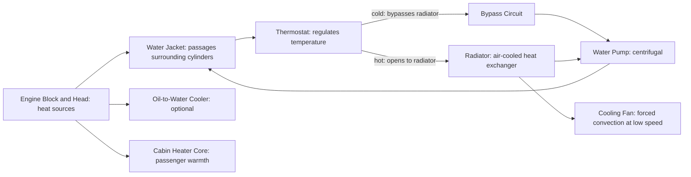

# Cooling System

## What It Is

The cooling system maintains engine component temperatures within safe operating
ranges by carrying heat away from the cylinder walls, cylinder head, and other
hot components. Without cooling, aluminium pistons would soften, oil would coke,
valves would stick, and the engine would seize.

The cooling system is also a precision thermal management system: too cold is
nearly as bad as too hot, causing increased friction, poor combustion, and higher
emissions.

---

## System Overview



---

## Coolant

The coolant is typically a 50/50 mixture of water and ethylene glycol (antifreeze):

| Property | Water | 50/50 Glycol-Water |
|---|---|---|
| Boiling point (at 1 bar) | 100°C | ~107°C |
| Boiling point (at 1.5 bar system) | 121°C | ~129°C |
| Freezing point | 0°C | ~-37°C |
| Heat capacity | 4182 J/(kg·K) | ~3400 J/(kg·K) |
| Thermal conductivity | 0.60 W/(m·K) | ~0.42 W/(m·K) |

The pressurised cooling system (typically 0.9–1.5 bar gauge) raises the boiling
point, preventing boiling in hot spots near the exhaust valves (~130°C local
coolant temperature possible without boiling).

### Corrosion Inhibitors
Glycol mixtures contain additive packages: corrosion inhibitors for aluminium, iron,
copper (radiator), and elastomers. These deplete over time — coolant must be replaced
every 2–5 years or per manufacturer schedule.

---

## Thermostat

The thermostat is a wax-pellet valve that opens at a calibrated temperature (typically
82–92°C). Below this temperature, coolant bypasses the radiator and recirculates
through the engine only — warming up faster.

```
  Below T_open:   bypasses radiator → quick warm-up
  Above T_open:   opens to radiator → maintains temperature setpoint
```

Why warm up quickly?
- Cold oil is thick → high friction → more fuel needed
- Cold walls quench combustion → higher HC emissions
- Fuel doesn't vaporise well on cold port walls (PFI) → rich mixture

A failed-open thermostat (stuck open) keeps the engine cold → never reaches efficiency.
A failed-closed thermostat → overheating → head gasket failure.

---

## Water Pump

The water pump circulates coolant. It is typically centrifugal (impeller-driven),
belt or chain driven from the crankshaft:

```
  Q = K × (RPM - RPM_min)    (proportional to speed above cutoff)

  Typical flow: 50–200 L/min at operating RPM
  Head generated: 0.5–2 bar
  Power consumed: 0.5–3 kW
```

Electric water pumps (increasingly common on modern vehicles):
- Run speed independently of engine RPM → more flow when needed, less when not
- Continue circulating after engine off (turbo heat soak, EV thermal management)
- Can enable cylinder deactivation cooling management

---

## Radiator

The radiator is a cross-flow or down-flow air-cooled heat exchanger:

```
  Q_rad = U × A × LMTD

  where:
    U    = overall heat transfer coefficient [W/(m²·K)] (~100–300 for typical radiators)
    A    = heat transfer area [m²]
    LMTD = log mean temperature difference between coolant and air
```

### Effectiveness at Different Conditions

At idle or low speed: insufficient airflow through the radiator → fan required.
At highway speeds: ram air provides adequate cooling, fan not needed.

Modern electric fans switch on based on coolant temperature sensor, running only
when needed.

### Pressure Cap

The pressure cap on the coolant reservoir maintains system pressure. At the rated
pressure it opens to release excess pressure to an overflow bottle. When the engine
cools, vacuum draws coolant back from the bottle (closed expansion system).

---

## Heat Rejection Budget

For a typical 100 kW naturally aspirated gasoline engine at full load:

```
  Fuel power input:     ~300 kW  (at 33% thermal efficiency)
  Brake output:         100 kW
  Exhaust heat:         ~115 kW
  Coolant heat:         ~75 kW
  Oil/radiation/other:  ~10 kW
```

The cooling system must be sized to reject the coolant share (here ~75 kW) under
the worst case: maximum power at high ambient temperature (35°C+) with no ram air
(stuck in traffic).

---

## Thermal Time Constants

| Component | Approximate warm-up time constant |
|---|---|
| Coolant (bulk) | 3–10 minutes |
| Cylinder head | 5–15 minutes |
| Cylinder block | 10–20 minutes |
| Oil (bulk) | 10–30 minutes |

Coolant warms faster than oil because the coolant is actively circulated past the
heat sources, while oil at the bottom of the sump is insulated.

---

## Overheating

Overheating causes:
1. **Head gasket failure** — thermal distortion of the block or head surface breaches the seal
2. **Piston seizure** — thermal expansion closes running clearance
3. **Bore distortion** — uneven thermal expansion deforms the bore
4. **Detonation spiral** — hot combustion chamber → knock → retarded timing → more exhaust heat → hotter coolant

Warning signs: rising temperature gauge, coolant loss, steam from radiator.

---

## Advanced Thermal Management

### Split Cooling
Separate thermostats for the block (lower temperature, ~75°C) and head (higher
temperature, ~95°C). This optimises knock resistance (cooler head) while reducing
friction in the block (warmer block reduces oil viscosity faster).

### Cylinder Deactivation Thermal Management
When deactivating cylinders, those cylinders must be kept hot to prevent condensation
and oil dilution — controlled oil and coolant flow is required.

### EGR Cooling
EGR coolers reduce the temperature of recirculated exhaust gas. A water-cooled EGR
cooler lowers intake charge temperature, further reducing NOx.

---

## Simulation Notes

For a cooling system simulation you need:

- `coolant_temperature` — typically treated as a fixed boundary condition for
  simplified models, or as a slowly-evolving state variable
- Coolant temperature affects: wall temperature (via heat transfer boundary),
  oil temperature (via oil cooler or oil-water interface), charge temperature
  (via intake port walls)
- A full model requires: thermal mass of block + head + coolant volume,
  heat input from combustion (via wall heat transfer model), heat rejection
  to radiator (function of vehicle speed and fan state)
- Simple approximation: T_coolant = constant = 90°C (363 K)
- Dynamic model: dT_coolant/dt = (Q_engine_to_coolant - Q_radiator) / C_coolant
  where C_coolant = mass × specific_heat ≈ 5 kg × 3400 J/(kg·K) = 17,000 J/K
