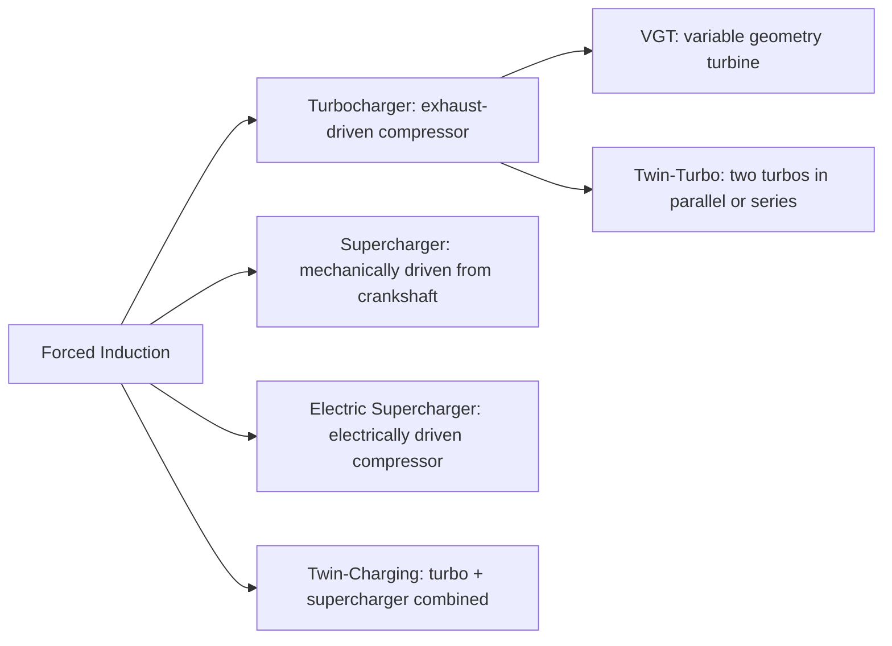
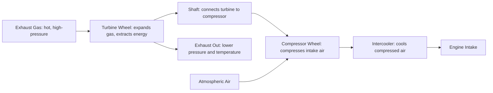

# Forced Induction

## What It Is

Forced induction (turbocharging or supercharging) increases the density of the intake
charge by compressing it before it enters the cylinder. More dense air means more
oxygen per cylinder volume, enabling more fuel to be burned and more power to be
produced from the same displacement.

A naturally aspirated engine's power output is fundamentally limited by how much air
it can breathe at atmospheric pressure. Forced induction breaks this limit.

---

## Why It Works

```
  Power ∝ m_air_per_cycle × energy_per_kg_of_mixture
  m_air = ρ_air × Vd × ηv
  ρ_air = P_intake / (R × T_intake)
```

Doubling intake pressure (2 bar absolute) doubles air density, which roughly doubles
the potential power output for the same displacement — if the engine structure can
handle it.

---

## Types of Forced Induction



---

## Turbocharger

A turbocharger consists of a turbine wheel and a compressor wheel on a common shaft,
connected by a centre housing (bearing housing).



### Compressor Map

The compressor's operating region is defined by a **compressor map** (pressure ratio
vs mass flow rate). Key features:

- **Surge line** (left boundary): at low flow rates, flow reverses intermittently
  (surge) — damages the compressor and creates a harsh noise
- **Choke line** (right boundary): at maximum flow, the compressor reaches sonic
  conditions — no more flow is possible at any inlet condition
- **Efficiency islands**: regions of high isentropic efficiency (typically 70–80%
  at best efficiency point)

```
  Pressure ratio PR = P_comp_out / P_comp_in

  Isentropic compressor efficiency:
  η_c = (PR^((γ-1)/γ) - 1) / (T_out/T_in - 1)
```

### Turbine Expansion

The turbine extracts energy from the exhaust gas:

```
  Power_turbine = ṁ_exhaust × Cp × T_turbine_in × η_t × (1 - PR_turbine^(-(γ-1)/γ))

  At steady state: Power_turbine = Power_compressor (shaft losses neglected)
```

Turbine inlet temperature is limited by material constraints (~950°C for steel,
~1100°C for nickel superalloys). Rich enrichment at full load protects the turbine
by lowering EGT.

### Wastegate

The wastegate is a bypass valve around the turbine. When boost pressure reaches the
target, the wastegate opens, diverting exhaust gas past the turbine:

- **Internal wastegate:** flap valve integrated into the turbine housing
- **External wastegate:** separate valve, vents to atmosphere or back to exhaust
  (race cars) or back to the exhaust downstream of turbo (street cars for emissions)

```
  Boost control: ECU duty-cycles the wastegate actuator to maintain target boost
```

### Variable Geometry Turbine (VGT)

The turbine vanes can rotate to change the effective turbine throat area:
- Small area: higher exhaust velocity → more turbine energy → faster spool at low RPM
- Large area: lower restriction at high RPM → less back pressure → better efficiency

VGT completely eliminates the trade-off between low-RPM response and high-RPM
power. Common on diesel engines, increasingly used on gasoline (BMW, Porsche).

### Turbo Lag

Turbo lag is the delay between throttle application and boost pressure reaching target.
Caused by:
- Rotational inertia of the turbine-compressor assembly (turbocharger inertia)
- Time to accelerate exhaust mass flow
- Volume of intake piping to fill with pressurised air

```
  J_turbo × dω_turbo/dt = τ_turbine - τ_compressor

  Typical rotor speed: 100,000–300,000 RPM
  Spool-up time: 0.5–3 seconds
```

Techniques to reduce lag:
- Smaller turbine (less inertia, but limits high-RPM flow)
- Twin-scroll turbo (uses exhaust pulse energy more effectively)
- Electric wastegate actuator (faster response)
- 48V electric motor on turbo shaft (e-turbo)

---

## Intercooler (Charge Air Cooler)

Compressing air heats it significantly (isentropic heating):

```
  T_2 = T_1 × PR^((γ-1)/γ)

  At PR = 2.0, T_1 = 300 K:
  T_2 = 300 × 2^(0.4/1.4) ≈ 300 × 1.219 ≈ 366 K (93°C)

  In practice (with compressor inefficiency, η_c ≈ 0.75):
  T_2_actual = T_1 + (T_2_isentropic - T_1) / η_c ≈ 383 K (110°C)
```

Cooling the charge from 110°C back to 40°C increases density by approximately
(383/313) ≈ 22% — significant power recovery.

```
  Intercooler effectiveness:
  ε = (T_in - T_out) / (T_in - T_coolant_air)

  Typical air-to-air intercooler: ε ≈ 0.7–0.85
```

---

## Supercharger

A supercharger is mechanically driven (belt, chain, or gear) from the crankshaft.
No exhaust energy harvested — all compression power comes from the engine itself.


### Supercharger Types

| Type | Mechanism | Character |
|---|---|---|
| Roots | Two meshing lobes, positive displacement | Instant response, lower peak efficiency |
| Twin-screw | Meshing helical rotors, internal compression | Higher efficiency than Roots, less heat |
| Centrifugal | Impeller similar to turbo compressor | High efficiency, power rises with RPM, laggy |
| Lysholm / Screw | Similar to twin-screw | Very efficient |

### Supercharger Parasitic Loss

```
  P_supercharger = ṁ_air × Cp × T_in × (PR^((γ-1)/γ) - 1) / η_c

  This is directly subtracted from crankshaft power
```

A 0.5 bar boost supercharger on a 2L engine might consume 20–30 kW — a significant
fraction of the ~150 kW it enables. Superchargers are less efficient than turbos
but have zero lag.

---

## Boost Pressure and Engine Limits

Adding boost pressure increases:
- Peak cylinder pressure → bearing load, con rod stress, head bolt load
- Combustion temperature → knock tendency
- Exhaust temperature → valve, turbine, catalyst limits

Boosted engines require:
- Lower compression ratio (typically 8–10 for turbo vs 10–13 for NA)
- Stronger pistons, rods, head studs
- Wider spark plug gap and lower advance
- Richer AFR at full load (λ ≈ 0.75–0.85) for EGT control

---

## Boost Pressure vs Knock

Higher intake pressure and temperature raise the compressed mixture temperature,
increasing knock tendency. Mitigations:
- Lower CR
- Intercooler (lower charge temperature)
- Water-methanol injection (latent heat cools charge)
- Rich AFR at WOT
- Anti-lag/knock retard strategy

---

## Simulation Notes

For a forced induction simulation you need:

- Compressor map: PR × ṁ → η_c (lookup table or polynomial fit)
- Turbine map: PR × ṁ → η_t
- Turbo shaft dynamics: J × dω/dt = τ_turbine - τ_compressor
- Boost pressure: P_intake = PR × P_ambient
- Intercooler: T_after_intercooler = T_after_compressor - ε × (T_after_compressor - T_ambient)
- Wastegate: PID controller on boost pressure
- Key output: `manifold_pressure` > `ambient_pressure` when boost active

Without compressor maps, a simplified approach:
- `boost_target` [Pa] = user-set target manifold pressure above ambient
- `manifold_pressure` = min(boost_target, actual_achieved_pressure)
- Turbo lag: first-order lag filter on manifold pressure (time constant ~0.5–2s)
