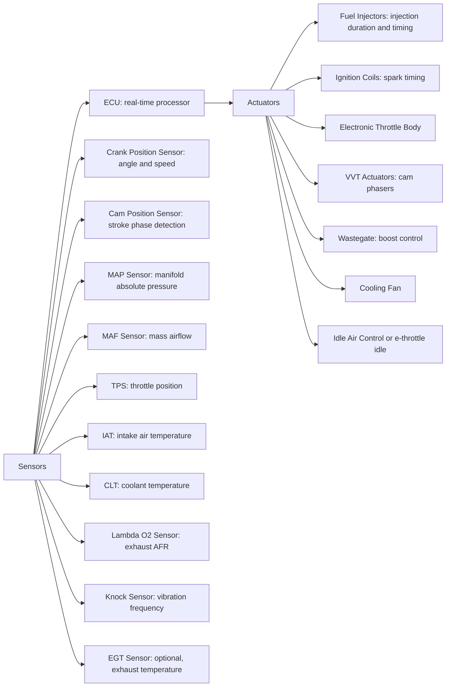
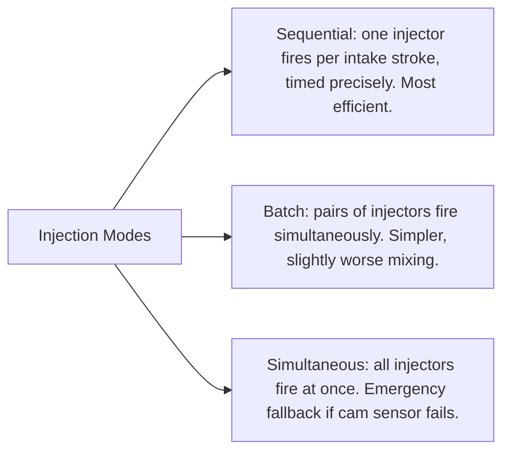

# Engine Management (ECU)

## What It Is

The Engine Control Unit (ECU) is the engine's brain. It reads sensors describing
the engine's state, executes control algorithms, and drives actuators to maintain
desired performance, efficiency, and emissions. Modern ECUs are sophisticated
real-time computers running at ~200 MHz, executing millions of instructions per
combustion event.

The ECU doesn't simulate the engine — it controls it. But a simulation must model
the ECU's behaviour to faithfully represent how a real engine responds to inputs.

---

## System Overview



---

## Key Control Loops

### Fuelling — Open Loop

At high load (WOT) or cold engine, the ECU uses a pre-calibrated fuel map:

```
  Injection_duration = Base_PW(RPM, MAP) × corrections

  corrections:
    × CLT_correction (rich at cold)
    × IAT_correction (richer in hot air for knock)
    × Lambda_correction (see closed loop below)
    × Accel_enrichment (transient spike on throttle opening)
    × Decel_enleanment (fuel cut on deceleration)
```

### Fuelling — Closed Loop

When a stoichiometric λ = 1 target is required (emissions mode), the lambda
sensor provides feedback:

```
  λ_error = λ_target - λ_measured
  Lambda_correction = 1.0 + K_p × λ_error + K_i × ∫λ_error dt    (PI controller)
```

This **long-term fuel trim (LTFT)** and **short-term fuel trim (STFT)** system
continuously adapts to aging injectors, fuel density changes, and air leaks.

### Ignition Timing

```
  Spark_advance = Base_map(RPM, load) × knock_correction × temperature_correction

  Base_map: 3D table, RPM × MAP → degrees BTDC
  Knock_correction: retards timing when knock detected (see [08-ignition-system.md])
  Temperature_correction: retards timing when coolant or intake air is hot
```

### Idle Speed Control

At idle, the ECU maintains target RPM (typically 600–900 RPM) by adjusting:
- Electronic throttle bypass (air)
- Ignition advance (more advance → more torque, holds RPM against load)

When A/C compressor engages (sudden load), the ECU briefly advances timing to
prevent RPM dip.

### Boost Control (Turbocharged Engines)

```
  Boost_error = Boost_target - Boost_actual
  Wastegate_duty = PID(Boost_error)
```

The PID controller drives the wastegate actuator (solenoid valve) to modulate how
much exhaust bypasses the turbine.

---

## Fuel Injection Modes



**Sequential injection** allows precise control of timing relative to intake valve
opening — the injector can spray just before or as the valve opens, maximising
mixing time.

---

## Sensor Fundamentals

### Crank Position Sensor

A toothed wheel (reluctor ring) on the crankshaft with a magnetic pickup or Hall
effect sensor. Typically 60-2 teeth (60 teeth with 2 missing, providing a reference
point). Each tooth represents 6° of crank rotation at 60 teeth.

```
  RPM = (tooth_count / teeth_per_revolution) × 60 / pulse_period    [rev/min]
```

The missing teeth allow synchronisation (the ECU knows exactly which crank angle
it's at from the tooth pattern).

### Manifold Absolute Pressure (MAP) Sensor

Measures absolute pressure in the intake manifold. Used to calculate air mass:

```
  m_air = P_manifold × Vd / (R_air × T_intake)    [speed-density method]
```

### Mass Airflow (MAF) Sensor

Measures actual air mass flow rate directly via a heated wire or film. More accurate
than MAP for transients. Modern engines often use both.

### Lambda (O₂) Sensor

- **Narrowband:** binary signal — rich or lean relative to λ = 1. Fast response, cheap,
  suitable for closed-loop λ = 1 control.
- **Wideband:** measures actual λ across a range (0.6–∞). Required for
  lean-burn calibration, turbo enrichment, and modern closed-loop strategies.

---

## Diagnostic Systems (OBD-II)

Since 1996 (USA) / 2001 (EU), all vehicles have an On-Board Diagnostics (OBD-II)
port providing standardised access to ECU data. The ECU monitors:
- Oxygen sensor response time and amplitude
- Catalyst efficiency (upstream vs downstream lambda comparison)
- Misfire detection (via crank speed fluctuation analysis)
- Fuel trim limits
- EGR flow

If a fault is detected that affects emissions, the Malfunction Indicator Lamp (MIL)
illuminates and a Diagnostic Trouble Code (DTC) is stored.

---

## ECU Calibration (Mapping)

The base calibration of an ECU is performed on a dynamometer. The calibrator:
1. Runs the engine at each RPM × load point
2. Records MBT ignition timing (finds maximum torque point)
3. Records optimal AFR at each point
4. Records VVT positions that maximise ηv and minimize emissions

The resulting 3D maps contain thousands of data points. Modern ECUs use model-based
calibration, where a physics model predicts optimal values and the dyno confirms.

---

## Simulation Notes

For an ECU simulation you need:

- **Throttle position → manifold pressure** (see [06-intake-system.md](06-intake-system.md))
- **Fuel control:**
  - Open loop: AFR = map lookup or constant stoichiometric
  - Closed loop: PI controller on lambda, adjusting injection duration
- **Ignition control:**
  - `spark_advance` = map lookup (RPM, load) or constant
  - Knock retard: decrement `spark_advance` on knock detection
- **Rev limiter:** cut fuel or ignition above `max_rpm`
- **Dyno load control:**
  - Speed mode: PI controller on RPM error → load torque
  - Load mode: constant load torque regardless of speed

The simulation's control loop corresponds directly to what an ECU does: read state,
compute corrections, write actuator commands. The key outputs are:
- `manifold_pressure` (throttle → intake model)
- `spark_advance` (ignition map + knock correction)
- Effective `afr` (fuelling map + lambda correction)
