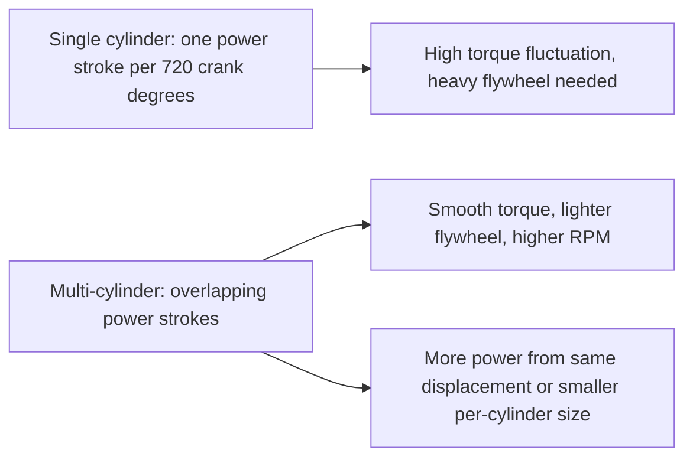
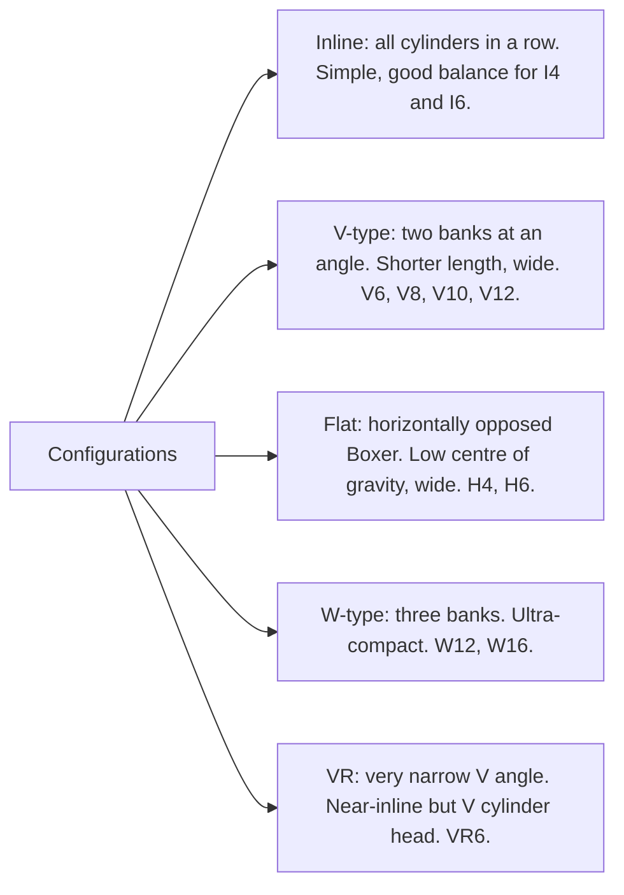

# Multi-Cylinder Engines

## What It Is

A single-cylinder engine delivers torque only during the power stroke —
roughly 180° of every 720° (one quarter of the cycle). This produces extreme
torque fluctuation, making a heavy flywheel essential and limiting smoothness.
Multi-cylinder engines solve this by staggering multiple cylinders so power
strokes overlap, producing smoother torque and allowing higher power density.

---

## Why Multiple Cylinders



For a 4-stroke engine with N cylinders, the firing interval is:

```
  Firing interval = 720° / N    [crank degrees between consecutive power strokes]

  N = 1  →  720°  (one power stroke per cycle)
  N = 2  →  360°
  N = 4  →  180°  (power stroke every half revolution — much smoother)
  N = 6  →  120°
  N = 8  →  90°   (nearly continuous torque)
  N = 12 →  60°
```

---

## Engine Configurations



### Inline 4 (I4)

The most common configuration worldwide.
- Firing interval: 180°
- Primary balance: perfectly balanced (two pistons always moving opposite)
- Secondary balance: unbalanced secondary forces (2× crank frequency). Balance shafts
  are added in most smooth I4 engines.
- Very compact, simple, light
- Typical: 1.0–2.5 L displacement

### Inline 6 (I6)

Considered the smoothest common configuration.
- Firing interval: 120°
- Primary AND secondary balance: completely balanced — no balance shafts needed
- Even firing order, very smooth torque
- Long engine — packaging challenge for transverse mounting
- Typical: 2.5–4.0 L displacement

### V6

Two banks of 3 cylinders at 60° or 90° angle.
- 60° V6: even firing with 120° intervals, compact, inherently balanced
- 90° V6: uneven firing unless a 30° crank offset is used (split pins); more vibration
- Shorter than I6, fits transverse packaging
- Typical: 2.5–4.0 L

### V8

Two banks of 4 cylinders.
- **Cross-plane crank** (90° offsets): used in American muscle cars and most production V8s.
  Uneven secondary balance, but isolates each bank's pulses → distinctive sound.
  Requires balance shafts or heavy counterweights.
- **Flat-plane crank** (180° offsets): each bank fires alternately in sequence.
  Better balance, but paired exhaust pulses interfere → needs dry-sump for oil control.
  Higher revving, used in Ferrari, Ford GT500, BMW M.
- Firing interval: 90°
- Typical: 4.0–8.0 L

### V10, V12

Used in high-end performance vehicles and motorsport.
- V10 at 72° or 90°: 72° spacing
- V12: effectively two I6s — perfect primary and secondary balance
- 60° firing interval for V12 → ultra-smooth torque

### Flat-4 / Boxer (H4)

Two cylinders on each side, pistons moving horizontally inward/outward.
- Lower centre of gravity than inline or V
- Good primary balance, secondary forces exist
- Longer and wider but lower height
- Used by Subaru, Porsche 911 (air-cooled historically, water-cooled since 1998)

---

## Firing Order

The firing order is the sequence in which cylinders fire. It is chosen to:
1. Space firing events as evenly as possible in time
2. Minimise torsional stress on the crankshaft (don't fire adjacent cylinders consecutively)
3. Optimise exhaust scavenging (cylinders sharing headers should have widely spaced events)

| Engine | Common Firing Order | Crank offsets |
|---|---|---|
| I4 | 1-3-4-2 | 0°, 180°, 540°, 360° |
| I4 (alt) | 1-2-4-3 | 0°, 180°, 360°, 540° |
| I6 | 1-5-3-6-2-4 | 0°, 240°, 480°, 120°, 360°, 600° |
| V8 cross-plane | 1-8-4-3-6-5-7-2 | 0°, 90°, 270°, 180° (×2) |
| V8 flat-plane | 1-5-2-6-3-7-4-8 | Alternating banks |

### Crankshaft Throw Arrangement (I4 Example)

For the standard I4 firing order 1-3-4-2 with 180° firing interval:

```
  Cylinder:  1    2    3    4
  Crank °:   0°  180° 540° 360°

  Stroke sequence:
  At 0°:    #1 fires (TDC power)
  At 180°:  #3 fires (TDC power)
  At 360°:  #4 fires (TDC power)
  At 540°:  #2 fires (TDC power)
```

Adjacent cylinders (#1 and #2) do not fire consecutively — this reduces main bearing
bending stress.

---

## Engine Balance

### Free Forces

Unbalanced forces in a multi-cylinder engine create vibration. They are classified by
their frequency relative to the crankshaft:

- **Primary forces:** at 1× crank frequency (same as RPM)
- **Secondary forces:** at 2× crank frequency (from the λ term in piston acceleration)
- **Higher harmonics:** less significant

A force is "free" (transmitted to the engine mounts) if the contributions from all
cylinders do not cancel.

### Balance Analysis

For N cylinders with crank angles θ_i and reciprocating mass m_r:

```
  F_primary = m_r × ω² × r × Σ(e^(iθ_k))    (complex exponential form)
  F_secondary = m_r × ω² × r × λ × Σ(e^(2iθ_k))
```

The sum is zero (perfectly balanced) when the crank throws are symmetrically distributed.

| Engine | Primary balance | Secondary balance |
|---|---|---|
| Single cylinder | Unbalanced | Unbalanced |
| I2 (360° crank) | Balanced | Unbalanced |
| I2 (180° crank) | Unbalanced | Balanced |
| I4 | Balanced | Unbalanced (secondary couple) |
| I6 | Balanced | Balanced |
| V8 cross-plane | Balanced | Balanced |

### Balance Shafts

A balance shaft rotates at 2× crank speed and carries counterweights that
generate forces equal and opposite to the unbalanced secondary forces:

- Common in I4 engines (Mitsubishi invented the Lanchester balance shaft system)
- Two shafts rotating in opposite directions cancel the secondary couple
- Adds ~3–5 kg and small parasitic power loss

---

## Displacement and Cylinder Size

Splitting displacement across more cylinders:
- Smaller per-cylinder displacement → shorter flame travel → less knock tendency
- More cylinders → more valve area per unit displacement → better breathing
- More cylinders → more friction (more rings, more bearings) → lower mechanical efficiency
- More cylinders → more complex, heavier, more expensive

Modern trend: fewer, larger turbocharged cylinders (downsizing) — 1.0L 3-cylinder
turbo replacing 1.6L NA 4-cylinder.

---

## Simulation Notes

For a multi-cylinder simulation you need:

- `cylinder_count` N — number of cylinders
- `crank_offsets_deg[i]` — firing offset for each cylinder i [degrees]
- Per-cylinder simulation: each cylinder has its own crank angle = θ + offset_i
- Total torque: sum of all per-cylinder torques at each simulation step
- Shared crankshaft inertia J — all cylinders contribute to the same spinning mass
- Audio: each cylinder's combustion and exhaust event contributes to the sound;
  the firing interval determines the fundamental frequency of the engine note

```
  f_fundamental = RPM / 60 × N_cylinders / 2    [Hz, for 4-stroke]
  (N/2 because there are N/2 power strokes per revolution)

  I4 at 3000 RPM: f = 3000/60 × 4/2 = 100 Hz (the "4-cylinder sound")
  V8 at 3000 RPM: f = 3000/60 × 8/2 = 200 Hz (the "V8 sound")
```

This fundamental frequency and its harmonics are the engine's acoustic signature.
